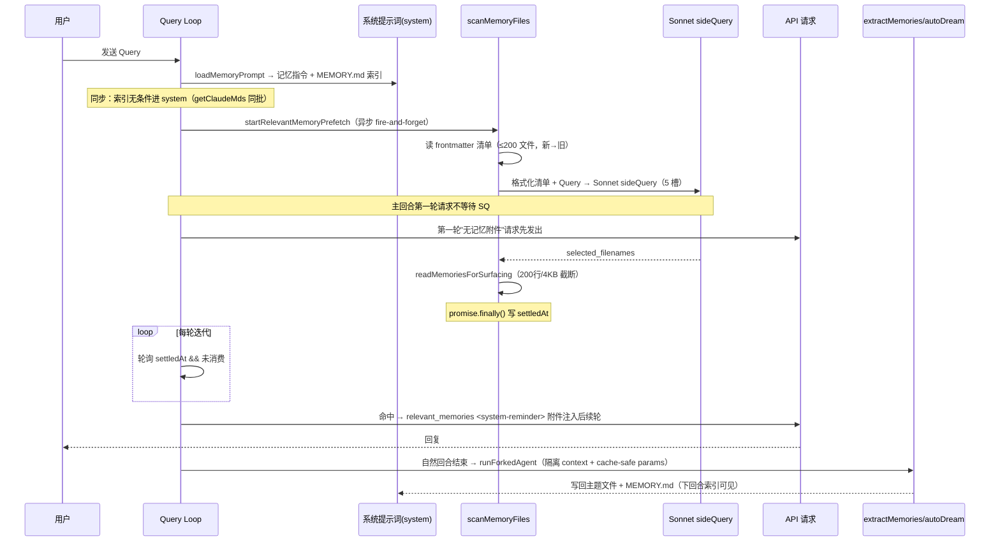
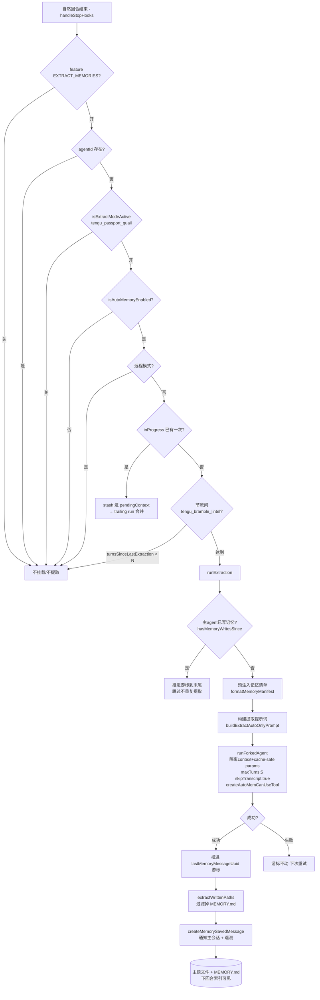

# Claude Code 记忆机制完全解析

> 从**可运行源码**出发，穷尽 Claude Code 记忆系统的全部细节：记忆的**类型**、**作用域**、**写入主体**、**运行模式**、**写入方式（two-step vs skipIndex）**、**召回方式**、**注入方式与对象**、**存储位置**、**提取原则**、**主要函数/脚本**、**触发条件**、**feature-gated 开关**与**触发频率**。
>
> 配套文档：`memory.md`（设计原则/类型/目录）、`memory_all.md`（九大维度+架构图）、`Claude Code 记忆机制架构分析.md`（读写全链路）、`Claude Code 记忆机制架构图.mmd`（独立可渲染的架构图）。
>
> 源码以 `src/` 下文件为准，所有行号基于当前仓库快照。

---

## 目录

1. [总览：记忆系统三大支柱](#1-总览记忆系统三大支柱)
2. [记忆类型 taxonomy（MEMORY_TYPES）](#2-记忆类型-taxonomymemory_types)
3. [记忆作用域（Scope）](#3-记忆作用域scope)
4. [记忆写入主体（Writers）：谁在写](#4-记忆写入主体writers谁在写)
5. [运行模式：auto / KAIROS / TEAMMEM](#5-运行模式auto--kairos--teammem)
6. [写入方式：two-step vs skipIndex](#6-写入方式two-step-vs-skipindex)
7. [提示词构建：buildMemoryLines / buildMemoryPrompt / loadMemoryPrompt](#7-提示词构建buildmemorylines--buildmemoryprompt--loadmemoryprompt)
8. [召回机制：scanMemoryFiles → Sonnet sideQuery → 注入](#8-召回机制scanmemoryfiles--sonnet-sidequery--注入)
9. [注入方式与对象](#9-注入方式与对象)
10. [存储位置汇总](#10-存储位置汇总)
11. [提取原则（什么该记 / 什么不该记）](#11-提取原则什么该记--什么不该记)
12. [feature-gated 开关总表](#12-feature-gated-开关总表)
13. [触发条件与频率专项](#13-触发条件与频率专项)
14. [关键函数/脚本索引表](#14-关键函数脚本索引表)
15. [详细 mermaid 架构图](#15-详细-mermaid-架构图)

---

## 1. 总览：记忆系统三大支柱

Claude Code 的记忆不是单一存储，而是三套**并行、隔离**的系统；另有两大变体（团队记忆、常驻日志）附着在自动记忆层之上。

```
┌──────────────────────────────────────────────────────────────────────┐
│  A. 静态记忆层（claudemd）                                             │
│     CLAUDE.md / CLAUDE.rules / CLAUDE.local.md + --append-system-prompt │
│     无条件、全 token 进入上下文——"项目规则"，非"记忆"但常被误认            │
│     注入路径：context.ts getClaudeMds → 用户上下文                       │
├──────────────────────────────────────────────────────────────────────┤
│  B. 自动记忆层（auto memory / memdir）——本文主题                        │
│     storage:  ~/.claude/projects/{hash}/memory/*.md                   │
│     索引(MEMORY.md)    → 同步进 system 提示词                          │
│     正文(主题文件)      → 异步召回注入 messages 的 <system-reminder>     │
│     写入(主体)          → 主 agent / extractMemories / autoDream       │
│     变体：team（仓库级共享）、KAIROS（append-only 日志）                 │
├──────────────────────────────────────────────────────────────────────┤
│  C. 子 Agent 记忆层（agent memory scope: user|project|local）           │
│     storage:  agent-memory/… 与 agent-memory-local/…                  │
│     通过 AgentTool 的 AgentMemoryScope 隔离，注入子 agent 的 system     │
└──────────────────────────────────────────────────────────────────────┘
```

**三大支柱一句话**：`B`（自动记忆）是默认的持久记忆；`C`（子 agent 记忆）是多 agent 场景下的隔离记忆；`A`（静态层）是项目/用户规则。

**两套 `MemoryType` 需分清**：
- **claudemd 静态层**（`src/utils/memory/types.ts`）：`User / Project / Local / Managed / AutoMem / TeamMem`（TeamMem 由 `feature('TEAMMEM')` 条件包含）。
- **memdir 自动记忆**（`src/memdir/memoryTypes.ts`）：`user / feedback / project / reference`（小写，带 frontmatter 的类型字段）。

---

## 2. 记忆类型 taxonomy（MEMORY_TYPES）

类型枚举定义在 [`src/memdir/memoryTypes.ts`](src/memdir/memoryTypes.ts#L14-L21)：

```ts
MEMORY_TYPES = ['user', 'feedback', 'project', 'reference']
```

每条（自动）记忆是一个**带 frontmatter 的 Markdown 文件**。frontmatter 格式（`MEMORY_FRONTMATTER_EXAMPLE`）：

```markdown
---
name: <short-kebab-case-slug>
description: <one-line summary — used to decide relevance during recall>
type: <user|feedback|project|reference>
---
<正文 — 对 feedback/project 类型，正文按 "rule/fact，然后 Why / How to apply" 组织>
```

| 类型 | 用途 | 特殊要求 |
|---|---|---|
| **user** | 用户画像：身份、偏好、领域、背景 | 无 |
| **feedback** | 用户对 Agent 行为的反馈（正向/负向） | 必须含 **Why** 与 **How to apply** 两节 |
| **project** | 项目目标、进展、决策、约束、截止日期 | 相对日期 → **绝对日期** 转换 |
| **reference** | 外部系统位置（URL、dashboards、tickets、Slack 频道） | 无 |

**两条提示词变体**（`memoryTypes.ts`）：
- `TYPES_SECTION_INDIVIDUAL`：单机 / auto 模式，无 `<scope>` 标签。
- `TYPES_SECTION_COMBINED`：TEAMMEM 团队模式，每个 `<type>` 块内嵌 `<scope>` 指引——**user 始终 private（私有）**，**feedback 偏向 private**，**project / reference 偏向 team（共享）**。

**记忆正文与索引分离**：`MEMORY.md` 是**索引而非正文**，正文存放于各类型主题文件（topic files）。索引只放一行指针 `- [Title](file.md) — one-line hook`。

### claudemd 静态层的"类型/作用域"对照

claudemd 的 `MemoryType` 实际是**加载作用域**（见 §3），不是语义分类。其路径解析见 [`src/utils/config.ts:getMemoryPath`](src/utils/config.ts#L1779-L1807)：

| claudemd 类型 | 路径 | 语义 |
|---|---|---|
| `Managed` | `/etc/claude-code/CLAUDE.md`（Linux）或平台等价目录 | 全用户全局指令 |
| `User` | `~/.claude/CLAUDE.md` | 个人全局指令（所有项目） |
| `Project` | `<cwd>/CLAUDE.md`、`.claude/CLAUDE.md`、`.claude/rules/*.md` | 项目指令，随仓库走、**可提交 git** |
| `Local` | `<cwd>/CLAUDE.local.md` | 个人项目指令，**不入 git** |
| `AutoMem` | `<autoMemPath>/MEMORY.md` | 自动记忆索引 |
| `TeamMem` | `<autoMemPath>/team/MEMORY.md` | 团队记忆索引 |

---

## 3. 记忆作用域（Scope）

作用域是"记忆属于谁、被谁看到"的隔离单位，共有三套独立机制。

### 3.1 自动记忆作用域（主会话）

- 按 **project hash 隔离**：`~/.claude/projects/{sanitized-project-root-hash}/memory/`
- 路径计算：`getAutoMemPath()`（[`src/memdir/paths.ts:223`](src/memdir/paths.ts#L223)，memoize），优先级（paths.ts）：
  1. env `CLAUDE_COWORK_MEMORY_PATH_OVERRIDE`（Cowork 全路径覆盖）
  2. `settings.json` 的 `autoMemoryDirectory`（仅 trustedsources：policy/local/user）
  3. 默认 `.claude/projects/{hash}/memory/`
- 同一仓库的 git worktree **共享**一个记忆目录

### 3.2 子 Agent 记忆作用域（AgentTool）

定义于 [`src/tools/AgentTool/agentMemory.ts:13`](src/tools/AgentTool/agentMemory.ts#L13)：`AgentMemoryScope = 'user' | 'project' | 'local'`。**用户问题中提到的 "user/project/local" 作用域主要对应这一套子 agent 记忆系统。**

| Scope | 目录（`getAgentMemoryDir`） | 语义 |
|---|---|---|
| **user** | `~/.claude/agent-memory/{agentType}/` | 全局 Agent 知识，跨所有项目共享（"boldly canonicalize"） |
| **project** | `<cwd>/.claude/agent-memory/{agentType}/` | 项目特定知识，随仓库走、**可提交进 git** |
| **local** | `<cwd>/.claude/agent-memory-local/{agentType}/`（支持 `CLAUDE_CODE_REMOTE_MEMORY_DIR` 重定向） | 本机+本项目专属，**不入 git**（"tailor to this project and machine"） |

- `{agentType}` 中的 `:` 会被替换成 `-`（插件命名空间化）。
- `loadAgentMemoryPrompt(agentType, scope)`（agentMemory.ts:138）为每个子 agent 注入对应 scope 的记忆指令，含 `scopeNote`，最终走 `buildMemoryPrompt`。
- 配套 `isAgentMemoryPath`（防越界写入校验）。

### 3.3 团队记忆作用域（TEAMMEM）

- 按 **repo 隔离**（不是按机器）：`~/.claude/projects/{hash}/memory/team/`
- `getTeamMemPath()` = `join(getAutoMemPath(), 'team')`（teamMemPaths.ts），递归 mkdir 时顺带建出 auto 目录。
- 远端：`GET/PUT /api/claude_code/team_memory?repo=<repo>`。
- 一致性：per-key SHA-256 校验和 + HTTP **ETag / 304**（本地没变不重复下载）；冲突返回 **412** 走合并逻辑。
- `isTeamMemoryEnabled()`（teamMemPaths.ts:73）：需要 `isAutoMemoryEnabled()` 且 `tengu_herring_clock` 为真。

---

## 4. 记忆写入主体（Writers）：谁在写

记忆可由六个主体写入，它们**互补而非替代**：

| 主体 | 触发点 | 本质 |
|---|---|---|
| **主 agent** | 用户 `/remember` 或用户明确要求记住时 | system 记忆指令指导它直接 `Write` 主题文件 + 更新 MEMORY.md |
| **extractMemories**（后台提取） | stop hook（自然回合结束） | turn-end 增量提取：把该回合新信息 fork 出子模型挑选、写回 |
| **autoDream**（后台整合） | stop hook（自然回合结束） | 低频跨会话整合：consolidate 分散记忆成精炼主题文件（dream 命令） |
| **/remember skill** | 用户主动 `/remember` | ant-only（`USER_TYPE !== 'ant'` 时 no-op）；是记忆**审查/迁移入 CLAUDE.md** 工具，不是 writer |
| **/dream skill**（KAIROS） | 定时/手动 | 对 append-only 日志**蒸馏**成主题记忆（本快照为 feature-gated 空壳） |
| **sessionMemory** | post-sampling hook | **会话记忆快照**（供 compaction），与面向用户的持久记忆语义不同 |

**关键区分**：
- `extractMemories`（提取新信息）与 `autoDream`（整合既有记忆）是**配合关系**：前者把点滴信息写新文件，后者定期合并去重。二者都复用 `runForkedAgent`，但**互不调用、互不感知**，共享 `createAutoMemCanUseTool`。
- `/remember`（本快照）**不写持久记忆文件**，而是引导用户把重要约定**迁移进 CLAUDE.md**（审查 + promote）。
- `sessionMemory` 虽写 "memory" 文件，但语义是**会话/压缩上下文**，服务 compaction，与面向用户的持久记忆不同。

---

## 5. 运行模式：auto / KAIROS / TEAMMEM

记忆系统有四种运行模式，由 `loadMemoryPrompt`（[`src/memdir/memdir.ts:419`](src/memdir/memdir.ts#L419)）按优先级分派：

```
loadMemoryPrompt()
 ├─ KAIROS && autoEnabled && getKairosActive()
 │    → buildAssistantDailyLogPrompt(skipIndex)    # ① 常驻日志模式（优先级最高）
 ├─ TEAMMEM && isTeamMemoryEnabled()
 │    → teamMemPrompts.buildCombinedMemoryPrompt() # ② 团队记忆合成
 ├─ autoEnabled
 │    → buildMemoryLines('auto memory', …)         # ③ 单机自动记忆（默认）
 └─ 否则 → logEvent('tengu_memdir_disabled') + 返回 null  # ④ 禁用
```

### 5.1 auto（默认，单机自动记忆）

- 目录：`~/.claude/projects/{hash}/memory/`
- 索引（MEMORY.md）进 system；正文按需召回进 messages
- 写入：主 agent（mixed）+ extractMemories（two-step）+ autoDream（维护索引）

### 5.2 KAIROS（常驻/assistant 模式）

- 前置：`feature('KAIROS')` 且 `getKairosActive()` 为真。
- 会话是**永久（perpetual）**的，agent 把新记忆以 **append-only 方式追加到日期命名的日志文件**，而非维护 MEMORY.md 实时索引：

```
${memoryDir}/logs/YYYY/MM/YYYY-MM-DD.md
```

- 日志是 append-only：每条为短时间戳子弹；跨午夜滚动到新日期文件；不重写不重组。
- **MEMORY.md 仍被加载**（已蒸馏的索引），但 agent **不直接编辑它**（"do not edit it directly — record new information in today's log instead"）。
- 一台 **nightly /dream skill** 把日志蒸馏成主题文件 + MEMORY.md。
- `skipIndex=true` 时日志模式也不输出 MEMORY.md 相关章节。
- **提示词缓存**：日志路径写成模式而不是今天的字面路径，因为该段被 `systemPromptSection('memory')` 缓存、日期变化时不失效；模型从 `date_change` 附件（午夜翻转时附加在尾部）推导当前日期，保留 prompt cache 前缀。

### 5.3 TEAMMEM（团队记忆）

- 前置：`feature('TEAMMEM')` 且 `isTeamMemoryEnabled()`（需 `tengu_herring_clock`，且 auto memory 开）。
- 双目录并存：`autoDir`（private）+ `teamDir`（team，= autoDir/team）。
- `buildCombinedMemoryPrompt` 把两目录合成一段 system 提示词，含 `<scope>` 指引 + "private / team" 双 MEMORY.md 索引。
- 本地写 + push 同步（ETag/校验和/412 合并）。
- **与 KAIROS 互斥**：append-only 日志范式与共享 MEMORY.md 读写模型冲突。

### 5.4 四模式优先级与互斥

```
KAIROS 常驻日志   ⊥  TEAMMEM 团队共享      （数据源范式冲突，互斥）
auto 单机         ⊆ 其 上可叠加 TEAMMEM     （团队是 auto 的超集）
禁用 env/setting → 全部关闭（tengu_memdir_disabled）
```

---

## 6. 写入方式：two-step vs skipIndex

是否维护 MEMORY.md 索引由 **`tengu_moth_copse`** 开关（默认 `false`）决定。

### 6.1 two-step（默认，非 skipIndex）

两步写入（`buildMemoryLines` 的 howToSave）：
- **Step 1**：把记忆写成本身的文件（带 frontmatter：name/description/type）。
- **Step 2**：在该目录的 `MEMORY.md` 加一行指针 `- [Title](file.md) — one-line hook`（每行 <150 字符，无 frontmatter，正文绝不写入索引）。

主 agent / extractMemories / autoDream 默认采纳此模式。

### 6.2 skipIndex（KAIROS / `tengu_moth_copse`=true）

- 只写记忆文件，**不维护 MEMORY.md** 索引。
- 常与 KAIROS 日志模式配合：只追加日期命名的日志文件，索引由夜间 /dream 蒸馏维护。

### 6.3 索引体积治理（`truncateEntrypointContent`，[`src/memdir/memdir.ts:57`](src/memdir/memdir.ts#L57)）

- `MAX_ENTRYPOINT_LINES = 200`、`MAX_ENTRYPOINT_BYTES = 25_000`。
- 超限截断并追加**诊断+修复指引**：`"...Keep index entries to one line under ~200 chars; move detail into topic files."` —— 警告不只是报问题，还**教模型如何修复**。
- 多个构建器（buildMemoryLines / buildMemoryPrompt / buildCombinedMemoryPrompt / buildAssistantDailyLogPrompt / claudemd 的 parseMemoryFileContent）都会用它截断 MEMORY.md。

---

## 7. 提示词构建：buildMemoryLines / buildMemoryPrompt / loadMemoryPrompt

记忆提示词分三层构建函数。

### 7.1 `buildMemoryLines`（[`src/memdir/memdir.ts:199`](src/memdir/memdir.ts#L199)，核心指令模板）

产物是一段**指令文案**（不含 MEMORY.md 正文），按序拼接：

```
# {displayName}
You have a persistent, file-based memory system at `{memoryDir}`…（DIR_EXISTS_GUIDANCE）
You should build up this memory system over time…
If the user explicitly asks you to remember…/forget…
[TYPES_SECTION_INDIVIDUAL]                       <- 四种类型，无 <scope>
[WHAT_NOT_TO_SAVE_SECTION]                       <- 明确排除
[howToSave]                                      <- 取决于 skipIndex：two-step vs skipIndex
[WHEN_TO_ACCESS_SECTION + MEMORY_DRIFT_CAVEAT]   <- 何时访问
[TRUSTING_RECALL_SECTION]                        <- "Before recommending…" 验证章节
## Memory and other forms of persistence
- 何时用 plan 而不是 memory
- 何时用 tasks 而不是 memory
[extraGuidelines ?? []]                          <- Cowork env 注入
[buildSearchingPastContextSection(memoryDir)]    <- 搜索历史上下文指引（tengu_coral_fern）
```

### 7.2 `buildMemoryPrompt`（[`src/memdir/memdir.ts:272`](src/memdir/memdir.ts#L272)，子 agent 版）

在 `buildMemoryLines` 的指令段后 **push 一段 `## MEMORY.md`**，把索引全文灌进提示词。它服务的"读者"是**子 agent**——子 agent **没有主会话的 `getClaudeMds()` 索引加载链路**，必须在此显式载入索引：
1. 该记忆目录的完整可用索引（`t.content`）。
2. 截断后的边界感知（经 `truncateEntrypointContent`，基于真实字节/行数给出精确诊断）。
3. telemetry：`logMemoryDirCounts` 埋 `tengu_memdir_loaded`，区分 `displayName === 'auto memory' ? 'auto' : 'agent'`。

### 7.3 `loadMemoryPrompt`（[`src/memdir/memdir.ts:419`](src/memdir/memdir.ts#L419)，主会话统一分派器）

见 §5。额外职责：`ensureMemoryDirExists` 保证目录存在、`logMemoryDirCounts` 遥测、`teamMemPaths`/`teamMemPrompts` 条件 require、Cowork env 策略注入、禁用时返回 null 使 memory 段整体消失。

**3 个调用点**：
1. [`src/constants/prompts.ts:476`](src/constants/prompts.ts#L476) — PROACTIVE/KAIROS 扁平提示词分支。
2. [`src/constants/prompts.ts:495`](src/constants/prompts.ts#L495) — `systemPromptSection('memory', () => loadMemoryPrompt())`（主动态段）。
3. [`src/QueryEngine.ts:318`](src/QueryEngine.ts#L318) — SDK/自定义提示词路径（`hasAutoMemPathOverride()` 时附加记忆机制提示词）。

**与 claudemd 的关系**：`loadMemoryPrompt`（memdir/auto-memory 指令 + MEMORY.md 索引）与 `getClaudeMds`（经典 claudemd CLAUDE.md/rules 内容，注入 `getUserContext.claudeMd`）是**平行、叠加**的机制。经典 CLAUDE.md 内容**不走** `loadMemoryPrompt`，走 `context.ts:getUserContext`。

---

## 8. 召回机制：scanMemoryFiles → Sonnet sideQuery → 注入

> 核心：召回**不是向量检索**，而是 **Sonnet 侧查询（sideQuery）**——拿用户 query + 记忆清单（只看 frontmatter 的 description）去问一个独立小模型"挑哪些最相关"。

### 8.1 全链路

```
用户 Query（回合开始）
  └─ startRelevantMemoryPrefetch()（utils/attachments.ts:2361，异步 fire-and-forget）
       ├─ 门控：isAutoMemoryEnabled() && feature('tengu_moth_copse')   <- 默认关
       ├─ 取最后一条真实 user prompt（跳过 isMeta）；单次词条太短则放弃
       ├─ 会话累计字节 >= MAX_SESSION_BYTES 则放弃
       ├─ createChildAbortController（用户 Esc 立即取消）
       └─ getRelevantMemoryAttachments(...)（不 await）
            ├─ @agent 提及 → 只搜该 agent 记忆目录（隔离）；否则搜 auto mem 目录
            ├─ findRelevantMemories(query, dir, signal, recentTools, alreadySurfaced)
            │    ├─ scanMemoryFiles() → MemoryHeader 清单（读 frontmatter）
            │    ├─ 过滤 alreadySurfaced（不重复挑已示过的）
            │    ├─ selectRelevantMemories() → Sonnet sideQuery 挑 5 槽
            │    └─ 命中 → 返回 {path, mtimeMs}
            ├─ 过滤 readFileState（主模型 FileRead 过的） + alreadySurfaced，slice(0,5)
            └─ readMemoriesForSurfacing()（截断读正文）
  └─ 返回 MemoryPrefetch 句柄 {promise, settledAt, consumedOnIteration, [Symbol.dispose]}

主循环逐轮迭代（query.ts:301 `using pendingMemoryPrefetch = ...`）
  └─ 消费点 query.ts:1600
       if (settledAt !== null && consumedOnIteration === -1):
           await promise -> 过滤重复 -> relevant_memories 附件 yield 给后续轮次
           consumedOnIteration = turnCount - 1

若主回合先结束
  └─ [Symbol.dispose] -> controller.abort() 掐掉 sideQuery + 遥测弃置
```

### 8.2 `scanMemoryFiles`（[`src/memdir/memoryScan.ts:35`](src/memdir/memoryScan.ts#L35)）

- 读 `readdir` → 只收 `.md` / 排除 `MEMORY.md`。
- 每文件只读**前 30 行** frontmatter（`FRONTMATTER_MAX_LINES`）→ `MemoryHeader { filename, filePath, mtimeMs, description, type }`。
- 按 mtime 新→旧排序，上限 `MAX_MEMORY_FILES = 200`。
- `formatMemoryManifest`（memoryScan.ts:84）把清单格式化为 `- [type] filename (timestamp): description`。

### 8.3 `selectRelevantMemories`（[`src/memdir/findRelevantMemories.ts:77`](src/memdir/findRelevantMemories.ts#L77)）——Sonnet 侧查询

```ts
const result = await sideQuery({
  model: getDefaultSonnetModel(),                    // 固定默认 Sonnet（可被 ANTHROPIC_DEFAULT_SONNET_MODEL 覆盖）
  system: SELECT_MEMORIES_SYSTEM_PROMPT,
  skipSystemPromptPrefix: true,
  messages: [{ role: 'user', content: `Query: ${query}\n\nAvailable memories:\n${manifest}${toolsSection}` }],
  max_tokens: 256,
  output_format: { type: 'json_schema', schema: { properties: { selected_memories: { type:'array', items:{type:'string'} } }, required:['selected_memories'] } },
  querySource: 'memdir_relevance',
})
```

`SELECT_MEMORIES_SYSTEM_PROMPT` 原文要点：
- 返回**最多 5 个**文件名；**只挑确信有帮助的**（"Be selective and discerning"）。
- 不确定就不选；没有明确有用的就返回空表。
- 若提供 `recentTools`：**不要选**这些工具的使用参考/API 文档类记忆；但含 **warnings/gotchas/known issues** 类则**要选**（正在用正是它们要紧的时候）。

> **重要模型差异**：召回固定用**默认 Sonnet**（`getDefaultSonnetModel`），而不是主会话当前模型。这与 extractMemories / autoDream（用主会话当前模型以命中 prompt cache）不同。

### 8.4 `readMemoriesForSurfacing`（attachments.ts:2279）——截断读正文

- `MAX_MEMORY_LINES = 200`、`MAX_MEMORY_BYTES = 4096`（每文件）。
- 经 `readFileInRange`（`truncateOnByteLimit: true`）；截断则追加 `"> This memory file was truncated (…). Use the {FILE_READ_TOOL} tool to view the complete file at: {path}"` 提示。
- 预计算 `header`（"保存于 N 天前"），**避免每次 Date.now() 字节变化击穿 prompt cache**。

### 8.5 三道总量闸控

`alreadySurfaced` 去重 + `readFileState`（主模型 FileRead 过的不再注入）+ 会话累计字节 `MAX_SESSION_BYTES`，避免记忆附件无限膨胀。

---

## 9. 注入方式与对象

记忆进入 API 请求体的**两条路径**：

### 9.1 索引 → system（同步、无条件）

- MEMORY.md 索引经 `loadMemoryPrompt` → `buildMemoryLines`/`buildCombinedMemoryPrompt` 进入 **system** 提示词（`systemPromptSection('memory')`）。
- 主会话还通过 **`getClaudeMds()`**（claudemd.ts:1153）与 CLAUDE.md 同批次加载 MEMORY.md——**模型第一个回合就知道有哪些记忆**。`getClaudeMds` 把每个文件格式化为 `Contents of <path><description>:\n\n<content>`，前缀固定指令 `MEMORY_INSTRUCTION_PROMPT`（"Codebase and user instructions…"）。TeamMem 内容包 `<team-memory-content source="shared">`。

### 9.2 正文 → messages（异步、按需、`<system-reminder>`）

- 召回命中的正文，经 `createAttachmentMessage` 渲染为 `<system-reminder>` 附件，**注入最新一条 user message**。
- 附件类型：`{ type: 'relevant_memories', memories: [{ path, content, mtimeMs, header, limit? }] }`。
- `normalizeMessagesForAPI`（claude.ts:1266）+ `addCacheBreakpoints`（claude.ts:3063）处理，最终进请求体的 `messages` 数组。

### 9.3 注入对象矩阵

| 注入对象 | 内容 | 机制 |
|---|---|---|
| 主会话 system | MEMORY.md 索引 | `loadMemoryPrompt` + `getClaudeMds` |
| 主会话 user message | 召回正文 | `relevant_memories` `<system-reminder>` 附件 |
| 子 agent system | MEMORY.md 索引全文 | `loadAgentMemoryPrompt` → `buildMemoryPrompt` |
| @agent 提及的子 agent | 该 agent 记忆目录召回 | `getRelevantMemoryAttachments` 定向搜索 |
| 经典 CLAUDE.md/rules | 全部内容 | `context.ts:getUserContext` → `claudeMd`（memoize 整个会话） |
| MCP 指令 | MCP server `instructions` | `systemPromptSection('mcp_instructions')`，独立于记忆 |

---

## 10. 存储位置汇总

| 系统 | 路径 | 内容 |
|---|---|---|
| 自动记忆 auto | `~/.claude/projects/{hash}/memory/` | user/feedback/project/reference 主题文件 + `MEMORY.md` 索引 |
| 团队记忆 team | `…/memory/team/` | 与 auto 同构，含 `team/MEMORY.md` 索引 |
| KAIROS 日志 | `…/memory/logs/YYYY/MM/YYYY-MM-DD.md` | append-only 每日日志 |
| 子 agent user | `~/.claude/agent-memory/{agentType}/` | 全局 Agent 知识 |
| 子 agent project | `<cwd>/.claude/agent-memory/{agentType}/` | 项目知识（可提交 git） |
| 子 agent local | `<cwd>/.claude/agent-memory-local/{agentType}/` | 本机+项目专属（不入库） |
| claudemd Managed | `/etc/claude-code/CLAUDE.md` | 全用户全局指令 |
| claudemd User | `~/.claude/CLAUDE.md` + `~/.claude/rules/*.md` | 个人全局指令 |
| claudemd Project | `<cwd>/CLAUDE.md`、`.claude/CLAUDE.md`、`.claude/rules/*.md` `CLAUDE.local.md` | 项目指令 |
| autoDream 锁 | `…/memory/.consolidate-lock` | mtime=lastConsolidatedAt 的整合锁 |
| 会话记忆 | `~/.claude/session-memory/…` | 供 compaction 的快照（非持久用户记忆） |

**记忆目录启动判断链**（[`src/memdir/paths.ts:isAutoMemoryEnabled`](src/memdir/paths.ts#L30)）：

```
CLAUDE_CODE_DISABLE_AUTO_MEMORY env（1/true）→ 禁用
CLAUDE_CODE_DISABLE_AUTO_MEMORY env（0/false）→ 启用
CLAUDE_CODE_SIMPLE（--bare）                 → 禁用
远程模式(CLAUDE_CODE_REMOTE) 且无 CLAUDE_CODE_REMOTE_MEMORY_DIR → 禁用
settings.json 的 autoMemoryEnabled          → 按配置
默认                                      → 启用
```

---

## 11. 提取原则（什么该记 / 什么不该记）

### 11.1 决策树（`memoryTypes.ts` WHAT_NOT_TO_SAVE_SECTION + memory.md）

```
获取到一条信息
 ├─ Q1 能从代码 / Git / 文档直接读到？─是→ 不保存
 ├─ Q2 已在 CLAUDE.md？─是→ 不保存
 └─ Q3 属于哪一类？
     ├─ 用户身份/偏好      → user.md
     ├─ 行为纠正/肯定      → feedback.md（必须 Why + How to apply）
     ├─ 项目动态/决策       → project.md（相对日期→绝对日期）
     ├─ 外部系统位置        → reference.md
     └─ 都不是            → 不保存
```

### 11.2 明确排除（WHAT_NOT_TO_SAVE_SECTION）

1. 代码模式、约定、架构、文件路径、项目结构。
2. git 信息（历史、改动、改动人）。
3. 调试方案或修复记录。
4. 已写在 CLAUDE.md 的内容。
5. 临时任务细节（进行中细项、临时状态、当前对话上下文）。

### 11.3 召回信任原则（TRUSTING_RECALL_SECTION）

记忆认为存在 ≠ 真的存在；记忆提到的文件/函数/路径**必须验证**（"The memory says X exists" is not the same as "X exists now."）。

### 11.4 记忆新鲜度（[`src/memdir/memoryAge.ts`](src/memdir/memoryAge.ts)）

- `memoryAgeDays` / `memoryAge`（today/yesterday/N days ago）/ `memoryFreshnessText` / `memoryFreshnessNote`。
- 记忆 >1 天自动注入陈旧警告：`"Memories are point-in-time observations, not live state — claims about code behavior or file:line citations may be outdated."`
- 新鲜度拼进侧查询清单，让 Sonnet 挑选时对旧记忆降权。

### 11.5 与其他持久化机制的边界

- **plan**：实施前对齐方案（跨轮次用 plan，不是 memory）。
- **tasks**：当前会话内步骤追踪（用 tasks，不用 memory）。
- **memory**：未来会话才有用的信息。

---

## 12. feature-gated 开关总表

### 12.1 GrowthBook 远端开关（`getFeatureValue_CACHED_MAY_BE_STALE` / `getDynamicConfig_CACHED_MAY_BE_STALE`）

| 开关 | 默认 | 作用 |
|---|---|---|
| `tengu_passport_quail` | **false** | `EXTRACT_MEMORIES` 后台提取主门控 |
| `tengu_slate_thimble` | false | 允许非交互会话（`-p`/SDK）也跑提取 |
| `tengu_bramble_lintel` | 1 | extract 节流：每 N 个合格回合一次 |
| `tengu_moth_copse` | **false** | skipIndex 模式 + 召回预取门控 + 过滤 claudemd 中 AutoMem/TeamMem |
| `tengu_herring_clock` | false | 团队记忆总开关 |
| `tengu_onyx_plover` | enabled=false | autoDream 开关（settings `autoDreamEnabled` 未设时） |
| `tengu_session_memory` | false | 会话记忆（compaction notes）门控 |
| `tengu_sm_config` | {} | 会话记忆远端配置（默认 10k/5k/3） |
| `tengu_paper_halyard` | false | 让 `getClaudeMds` 跳过 Project/Local |
| `tengu_coral_fern` | false | "Searching past context" 段 |

### 12.2 编译期 feature 宏（`feature('...')`，`bun:bundle` tree-shaken）

| 宏 | 作用 |
|---|---|
| `EXTRACT_MEMORIES` | 条件加载/调用 extractMemories |
| `TEAMMEM` | 团队记忆代码路径 |
| `MEMORY_SHAPE_TELEMETRY` | 召回形状遥测 |
| `KAIROS` / `KAIROS_BRIEF` / `KAIROS_DREAM` / `PROACTIVE` | 常驻/assistant 模式 + nightly /dream skill |

### 12.3 settings / env

| 项 | 默认 | 作用 |
|---|---|---|
| `autoMemoryEnabled`（settings） | undefined→true | 自动记忆显式开关 |
| `autoMemoryDirectory`（settings） | 无 | 自动记忆目录覆盖（trusted sources） |
| `autoDreamEnabled`（settings） | optional | autoDream 显式开关 |
| `CLAUDE_CODE_DISABLE_AUTO_MEMORY`（env） | 无 | 自动记忆总开关 |
| `CLAUDE_CODE_SIMPLE` / `--bare`（env） | 无 | 禁用记忆（SIMPLE 早退 + gate） |
| `CLAUDE_CODE_REMOTE` / `CLAUDE_CODE_REMOTE_MEMORY_DIR`（env） | 无 | 远程模式 + 记忆目录重定向 |
| `CLAUDE_COWORK_MEMORY_PATH_OVERRIDE`（env） | 无 | Cowork 记忆路径覆盖 |
| `CLAUDE_COWORK_MEMORY_EXTRA_GUIDELINES`（env） | 无 | 注入额外记忆策略文字 |
| `ANTHROPIC_DEFAULT_SONNET_MODEL`（env） | 无 | 覆盖召回侧 Sonnet 模型 |

> **潜台词**：本快照（外部用户视角，无远端 GrowthBook payload）默认只有 auto memory 开、`tengu_moth_copse` 关 → 即 **two-step 双步骤 + 召回预取门控关闭**。`tengu_paper_halyard`、`tengu_coral_fern` 等均为可远端开启的开关。

---

## 13. 触发条件与频率专项

### 13.1 extractMemories（后台提取）

**入口**：[`src/query/stopHooks.ts:149`](src/query/stopHooks.ts#L149) `executeExtractMemories(context, appendSystemMessage)`（自然回合结束，`handleStopHooks`）。

**门控**：
1. `feature('EXTRACT_MEMORIES')` 编译宏 → 才挂载/调用。
2. `toolUseContext.agentId` 存在 → **跳过**（仅主 agent）。
3. `isExtractModeActive()`（paths.ts）：即 `tengu_passport_quail`；非交互（`-p`/SDK）还须 `tengu_slate_thimble`。
4. `!isAutoMemoryEnabled()` → 跳过。
5. `getIsRemoteMode()` → 跳过。
6. `inProgress`（已有一次在跑）→ 不并行：context stash 进 `pendingContext`，等当前跑完做一次 **trailing run**（合并）。
7. `!isBareMode()`（`--bare` 关闭）。

**频率（名义每回合，实际被闸控）**：
- **节流闸** `tengu_bramble_lintel`（默认 1）：`turnsSinceLastExtraction++` 达到阈值才真跑；**trailing run 跳过此闸**。
- **游标增量** `lastMemoryMessageUuid`：每次只处理游标后的新消息（`countModelVisibleMessagesSince`）。若游标因 compaction 丢失，回退到全量计数，避免永久禁用。
- **主 agent 已写则跳过** `hasMemoryWritesSince`：游标后主 agent 自己写过 memory 文件 → 跳过并推进游标到末尾（`tengu_extract_memories_skipped_direct_write`）。
- **单线程互斥 + trailing 合并**：`inProgress` 保证唯一运行；期间来的调用合并成一次 trailing run。
- 异步：`void` fire-and-forget；非交互由 print.ts `drainPendingExtraction`（60s）退出时收口。

**实现（`runExtraction` → `runForkedAgent`）**（extractMemories.ts:329 / :415）：
1. 预注入记忆清单：`formatMemoryManifest(await scanMemoryFiles(dir))`。
2. 构建提示词：`buildExtractAutoOnlyPrompt` / `buildExtractCombinedPrompt(newMessageCount, existingMemories, skipIndex)`（TEAMMEM 时后者）。
3. `runForkedAgent`：隔离 context + 复用主会话 cache-safe params（命中 prompt cache）+ `maxTurns:5` + `skipTranscript:true` + `createAutoMemCanUseTool`（限权记忆目录，Bash 只读、Edit/Write 仅记忆目录内）。
4. 成功才推进游标；出错游标不动、下次重试。
5. `extractWrittenPaths` → 过滤掉 MEMORY.md（`basename !== 'MEMORY.md'`）得"真正记忆" → 写记忆则 `createMemorySavedMessage` 通知主会话 + 遥测。
6. best-effort：catch 只记日志。

### 13.2 autoDream（dream 命令 / 后台整合）

**入口**：[`src/query/stopHooks.ts:154-156`](src/query/stopHooks.ts#L154) `executeAutoDream(context, appendSystemMessage)`；`runner` 由 `initAutoDream`（utils/backgroundHousekeeping.ts:37）注入。

**多级门控（`runAutoDream`，autoDream.ts:125-198，先便宜后贵）**：
```
isGateOpen()
 ├─ getKairosActive() → false
 ├─ getIsRemoteMode() → false
 ├─ isAutoMemoryEnabled() → false
 └─ isAutoDreamEnabled()   # settings autoDreamEnabled ?? tengu_onyx_plover.enabled===true（默认 false）
readLastConsolidatedAt()            # ② 时间闸：距上次整合 >= minHours(默认24)
scan throttle                       # ③ 扫描节流：SESSION_SCAN_INTERVAL_MS=10min
listSessionsTouchedSince()          # ④ 会话闸：>= minSessions(默认5)，排除当前会话
tryAcquireConsolidationLock()       # ⑤ 单锁：防多进程（拿不到→跳过）
```

**实现**：`buildConsolidationPrompt`（四阶段：Orient → Gather → Consolidate → Prune and index）→ `runForkedAgent`（cache-safe params、`createAutoMemCanUseTool`、`querySource:'auto_dream'`、`skipTranscript:true`、bg-task UI + kill + 锁回滚 `rollbackConsolidationLock(priorMtime)`）。**默认关闭**；开启后受 24h + 5 会话 + 扫描节流 + 整合锁多重门槛。

### 13.3 sessionMemory（会话记忆 / compaction，独立子系统）

- 注册为 **post-sampling hook**（非 stop hook）；`initSessionMemory`（sessionMemory.ts:357）→ `registerPostSamplingHook(extractSessionMemory)`，仅 `isAutoCompactEnabled()` 时注册，远程模式不注册。
- 门控：`tengu_session_memory`（sessionMemory.ts:81）。
- 远端配置：`tengu_sm_config`（sessionMemory.ts:90），默认 `minimumMessageTokensToInit=10000` / `minimumTokensBetweenUpdate=5000` / `toolCallsBetweenUpdates=3`；仅正数值覆盖默认。
- 判定 `shouldExtractMemory`（sessionMemory.ts:134）：**token 阈值总是必须**；当 (a) token 增长 + 工具调用数均达标，或 (b) token 增长达标且最后一轮无工具调用（自然断点）时提取。
- 作用域：仅 `querySource === 'repl_main_thread'`。
- 写会话记忆文件（`~/.claude/session-memory/`，0o700 目录 / 0o600 文件），模板 `services/SessionMemory/prompts.ts`（Session Title / Current State / Task spec / Files and Functions / Workflow / Errors & Corrections / Learnings / Key results / Worklog，`MAX_SECTION_LENGTH=2000`、`MAX_TOTAL_SESSION_MEMORY_TOKENS=12000`）。
- `manuallyExtractSessionMemory`（`/summary` 用）绕过阈值。

### 13.4 四种 turn-end 后台任务对照

| 维度 | extractMemories | autoDream | promptSuggestion | sessionMemory |
|---|---|---|---|---|
| 触发点 | stop hook | stop hook | stop hook | **post-sampling hook** |
| 目标 | 提取新信息成记忆 | 跨会话整合 | 预测下条输入 | 会话快照（compaction） |
| 用 runForkedAgent？ | 是 | 是 | **否**（单次生成） | 是 |
| 频率/闸控 | 每回合候选；bramble_lintel 节流+游标+去重+trailing | 24h + 5 会话 + 扫描节流 + 整合锁 | 每回合；冷缓存抑制 | token 阈值驱动（10k/5k/3） |
| 作用域 | 仅主 agent | 仅主 agent | 仅主线程 | 仅主线程 |

---

## 14. 关键函数/脚本索引表

| 模块 | 文件 | 关键符号 |
|---|---|---|
| 系统提示词注入 | `src/memdir/memdir.ts` | `loadMemoryPrompt:419`、`buildMemoryPrompt:272`、`buildMemoryLines:199`、`buildAssistantDailyLogPrompt:327`、`truncateEntrypointContent:57`、`ENTRYPOINT_NAME:34`、`MAX_ENTRYPOINT_LINES=200`、`MAX_ENTRYPOINT_BYTES=25_000` |
| 类型 | `src/memdir/memoryTypes.ts` | `MEMORY_TYPES`、`TYPES_SECTION_INDIVIDUAL/COMBINED`、`WHAT_NOT_TO_SAVE_SECTION`、`WHEN_TO_ACCESS_SECTION`、`TRUSTING_RECALL_SECTION`、`MEMORY_FRONTMATTER_EXAMPLE` |
| 扫描/清单 | `src/memdir/memoryScan.ts` | `scanMemoryFiles:35`、`formatMemoryManifest:84`、`MAX_MEMORY_FILES=200`、`FRONTMATTER_MAX_LINES=30` |
| 正文召回 | `src/memdir/findRelevantMemories.ts` | `findRelevantMemories:39`、`selectRelevantMemories:77`、`SELECT_MEMORIES_SYSTEM_PROMPT:18` |
| 预取/注入 | `src/utils/attachments.ts` | `startRelevantMemoryPrefetch:2361`、`getRelevantMemoryAttachments:2196`、`readMemoriesForSurfacing:2279`、`collectSurfacedMemories` |
| 新鲜度 | `src/memdir/memoryAge.ts` | `memoryAgeDays`、`memoryFreshnessText/Note` |
| 路径/开关 | `src/memdir/paths.ts` | `isAutoMemoryEnabled:30`、`isExtractModeActive:69`、`getAutoMemPath:223`、`getMemoryBaseDir` |
| 团队路径/提示词 | `src/memdir/teamMemPaths.ts` / `teamMemPrompts.ts` | `isTeamMemoryEnabled:73`、`getTeamMemPath`、`buildCombinedMemoryPrompt` |
| 侧查询 | `src/utils/sideQuery.ts` | `sideQuery:107` |
| 模型 | `src/utils/model/model.ts` | `getDefaultSonnetModel:119`（召回模型） |
| 后台提取 | `src/services/extractMemories/extractMemories.ts` + `prompts.ts` | `executeExtractMemoriesImpl:527`、`runExtraction:329`、`runForkedAgent:415`、`buildExtractAutoOnlyPrompt`、`createAutoMemCanUseTool:171`、`initExtractMemories:296` |
| 整合 | `src/services/autoDream/autoDream.ts` / `consolidationPrompt.ts` / `config.ts` / `consolidationLock.ts` | `runAutoDream`、`isGateOpen`、`buildConsolidationPrompt`、`isAutoDreamEnabled`、`.consolidate-lock` |
| 会话记忆 | `src/services/SessionMemory/sessionMemory.ts` / `sessionMemoryUtils.ts` / `prompts.ts` | `shouldExtractMemory`、`buildSessionMemoryUpdatePrompt`、`DEFAULT_SESSION_MEMORY_CONFIG` |
| 后台执行器 | `src/utils/forkedAgent.ts` | `runForkedAgent:489`、`createCacheSafeParams:131` |
| 子 agent 作用域 | `src/tools/AgentTool/agentMemory.ts` | `AgentMemoryScope:13`、`getAgentMemoryDir:52`、`loadAgentMemoryPrompt:138` |
| claudemd 静态层 | `src/utils/claudemd.ts` / `src/utils/config.ts` / `src/utils/memory/types.ts` | `getMemoryFiles:790`、`getClaudeMds:1153`、`filterInjectedMemoryFiles:1142`、`getMemoryPath:1779`、`MEMORY_TYPE_VALUES` |
| stop hook | `src/query/stopHooks.ts` | `executeExtractMemories:149`、`executeAutoDream:154-156` |
| 团队同步 | `src/services/teamMemorySync/` | fetch/push、ETag、校验和、412 冲突 |
| 注入 | `src/context.ts` / `src/services/api/claude.ts` | `getUserContext:155`（claudeMd）、`addCacheBreakpoints:3063`、`createAttachmentMessage` |
| 系统段 | `src/constants/prompts.ts` / `systemPromptSections.ts` | `systemPromptSection('memory')`、`resolveSystemPromptSections` |
| MCP 指令 | `src/services/mcp/client.ts` / `src/constants/prompts.ts:579` | `getMcpInstructions`、`client.getInstructions()` |

---

## 15. 详细 mermaid 架构图

> 系统全貌大图同时独立导出为 [`Claude Code 记忆机制架构图.mmd`](Claude%20Code%20记忆机制架构图.mmd)，可用 mermaid-cli / 在线渲染器单独渲染。

### 15.1 系统全貌（flowchart LR）——即独立 `.mmd` 内容

```mermaid
flowchart LR
    subgraph Modes[运行模式分派 · loadMemoryPrompt]
        direction TB
        L[loadMemoryPrompt] -->|KAIROS && active| KD[buildAssistantDailyLogPrompt<br/>logs/YYYY/MM/YYYY-MM-DD.md]
        L -->|TEAMMEM && enabled| KC[buildCombinedMemoryPrompt<br/>private + team 双索引]
        L -->|autoEnabled| KI[buildMemoryLines<br/>auto memory]
        L -->|否则|null + tengu_memdir_disabled
    end

    subgraph Types[记忆类型 MEMORY_TYPES]
        direction TB
        T1[user] --> T1f{frontmatter<br/>name/description/type}
        T2[feedback] -->|Why + How to apply| T1f
        T3[project] -->|相对日期→绝对日期| T1f
        T4[reference] --> T1f
    end

    subgraph Scopes[作用域 Scope]
        direction TB
        S1[auto · 主会话<br/>projects/{hash}/memory]
        S2[team · 仓库级<br/>memory/team + 远端同步]
        S3[agent user · agent-memory/user]
        S4[agent project · agent-memory/project]
        S5[agent local · agent-memory-local]
        S6[claudemd · User/Project/Local/Managed]
    end

    subgraph Writers[写入主体]
        direction TB
        W1[主 agent /remember]
        W2[extractMemories<br/>stop hook 增量]
        W3[autoDream<br/>stop hook 低频整合]
        W4[/dream KAIROS 蒸馏]
        W5[sessionMemory 快照]
    end

    subgraph Recall[召回注入]
        direction TB
        R1[用户 Query]
        R2[scanMemoryFiles<br/>frontmatter 清单 ≤200]
        R3[Sonnet sideQuery<br/>5 槽 JSON Schema]
        R4[readMemoriesForSurfacing<br/>200 行 / 4KB 截断]
        R1 --> R2 --> R3 --> R4
        R4 -->|relevant_memories 附件| R5[注 入 user message]
    end

    Modes --> Types
    Modes --> Scopes
    Modes --> Writers
    Writers -->|写主题文件+MEMORY.md| Scopes
    Scopes -->|系统提示词索引| INJ1[system 提示词]
    Recall -->|正文| INJ2[messages]
    INJ1 --> REQ[API 请求体]
    INJ2 --> REQ
```

### 15.2 读侧：索引进 system + 正文异步召回时序



### 15.3 写入侧：turn-end 后台提取（runForkedAgent 全流程）



### 15.4 目录与作用域树

```mermaid
flowchart TD
    ROOT[~/.claude/projects/{hash}/memory/]
    ROOT --> A1[user.md]
    ROOT --> A2[feedback.md]
    ROOT --> A3[project.md]
    ROOT --> A4[reference.md]
    ROOT --> AI[MEMORY.md 索引<br/>200 行 / 25KB]
    ROOT --> AL[.consolidate-lock<br/>autoDream 整合锁]
    ROOT --> LG[logs/YYYY/MM/YYYY-MM-DD.md<br/>KAIROS append-only]
    ROOT --> TM[team/ 目录<br/>TEAMMEM 仓库级]
    TM --> TM1[team/MEMORY.md]
    TM --> TM2[team 主题文件]
    TM -.ETag/校验和.-> TSRV[(远端<br/>/api/claude_code/team_memory)]

    AGT[agent-memory/ 与 agent-memory-local/]
    AGT --> AU[agent-memory/user/{type}<br/>全局]
    AGT --> AP[agent-memory/project/{type}<br/>可提交 git]
    AGT --> AL2[agent-memory-local/{type}<br/>本机不入库]

    CLD[claudemd 静态层]
    CLD --> CM[Managed · /etc/claude-code/CLAUDE.md]
    CLD --> CU[User · ~/.claude/CLAUDE.md + rules]
    CLD --> CP[Project · <cwd>/CLAUDE.md + .claude + rules]
    CLD --> CL[Local · CLAUDE.local.md]
```
