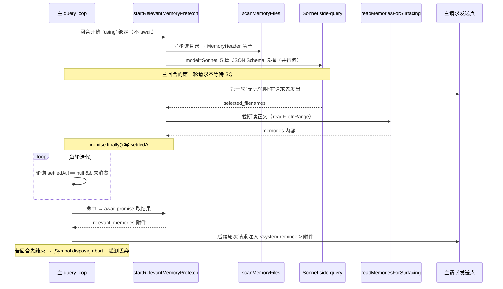
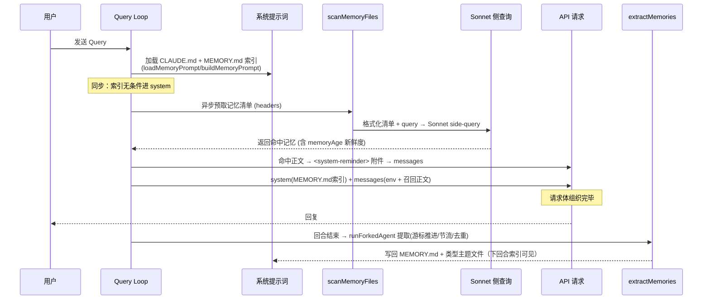

# Claude Code 记忆机制架构分析（全链路）

> 本文从**可运行源码**出发，逐条追踪 Claude Code 的记忆系统：从「用户发送 query」到「最终发给大模型的 API 请求体」，再到「回合结束后异步写回」的完整闭环。
> 配套：`memory.md`（记忆的**设计原则 / 类型 / 目录 / 启动判断**）、`静态系统提示词原文.md`、`动态系统提示词原文.md`。

---

## 0. 一张总图

```mermaid
flowchart LR
    subgraph S1[会话启动 / 每次回合]
        A[用户 Query] --> B[query loop]
    end

    subgraph ProjMem[静态层 · CLAUDE.md]
        CLAUDE[CLAUDE.md 项目指南]
        RULES[CLAUDE.rules 全局规则]
        CLAUDE -->|loadClaudeMd| SYS[系统提示词 system]
        RULES -->|loadClaudeMd| SYS
    end

    subgraph AutoMem[自动记忆层 · 持久文件]
        MEMDIR[~/.claude/projects/&#123;hash&#125;/memory/]
        MEMDIR -->|loadMemoryPrompt 同步| MEMPROMPT[MEMORY.md 索引块]
        MEMPROMPT -->|systemPromptSection memory| SYS
        MEMDIR -->|scanMemoryFiles 读取 header| MANIFEST[记忆清单 headers]
        MANIFEST -->|findRelevantMemories 异步预取| PREFETCH[relevant_memories 预取]
        PREFETCH -->|readMemoriesForSurfacing| ATTACH[<system-reminder> 附件]
        ATTACH -->|createAttachmentMessage| MESSAGES[messages 用户消息]
        SYS --> BODY[API 请求体<br/>system / messages / tools]
        MESSAGES --> BODY
    end

    subgraph Write[回合结束 · 异步写入]
        B -->|turn end| EXTRACT[extractMemories<br/>runForkedAgent 子模型]
        EXTRACT -->|write memory 文件| MEMDIR
    end

    subgraph AgentMem[子 Agent 记忆隔离]
        AGT[AgentTool] -->|AgentMemoryScope| AM[(agent-memory<br/>user/project/local)]
        AM -->|loadAgentMemoryPrompt| SYS
    end

    subgraph TeamMem[团队记忆同步]
        TEAM[tengu_herring_clock / TEAMMEM] -->|buildCombinedMemoryPrompt| SYS
        TEAM -->|GET/PUT /api/claude_code/team_memory| TSRV[(团队记忆服务<br/>ETag/校验和)]
    end
```



**一句话概括**：记忆分两层——**静态层**（CLAUDE.md / .rules，无条件进系统提示词）和**自动记忆层**（memdir 持久文件，索引进系统提示词、正文靠 LLM 按需召回附件）。两条路径最终都汇入 API 请求体的 `system` / `messages`，而**写入**则通过回合结束后 fork 出来的子模型异步完成。

---

## 1. 记忆的两层结构

Claude Code 的记忆不是单一存储，而是两个语义不同的层：

| 层 | 内容 | 加载时机 | 如何进请求 |
|---|---|---|---|
| **静态层** | CLAUDE.md（项目）、CLAUDE.rules（全局）、`--append-system-prompt` | 每次会话无条件加载 | 作为 **system** 提示词的一部分 |
| **自动记忆层** | `~/.claude/projects/{hash}/memory/*.md`（user/feedback/project/reference） | 索引每次进上下文案；正文**按需召回** | 索引进 **system**；正文作为 **messages** 中的 `<system-reminder>` 附件 |

关键区别：**静态层是"每个 token 都进"**，**自动记忆层只有索引进**，正文靠 `findRelevantMemories` 的 LLM 侧查询挑选——这是为了控制上下文成本。`memory.md` 明确指出 MEMORY.md 是**索引而非原始记忆**，正文存放在各自的主题文件里。

---

## 2. 读取侧：记忆如何被"召回"并注入请求

### 2.1 系统提示词注入 `loadMemoryPrompt`（memdir/memdir.ts:419）

`loadMemoryPrompt()` 是自动记忆层进入系统提示词的入口，调用链是 `systemPromptSection('memory', ...)` → `loadMemoryPrompt()`。它按优先级分派：

```
loadMemoryPrompt()
 ├─ KAIROS 且 autoEnabled 且 getKairosActive()
 │    → buildAssistantDailyLogPrompt()      # 常驻会话，append-only 日志模式
 ├─ TEAMMEM 且 isTeamMemoryEnabled()
 │    → teamMemPrompts.buildCombinedMemoryPrompt()   # 团队记忆合成
 ├─ autoEnabled
 │    → buildMemoryLines('auto memory', ...)         # 单机自动记忆
 └─ 否则 → logEvent('tengu_memdir_disabled', {...})  # 记录禁用原因 + 返回 null
```

产物是**一段系统提示词指令**，告诉模型：记忆在哪、四种类型分别怎么写、何时该写、怎么用 `[[name]]` 关联。`ensureMemoryDirExists` 会先保证目录存在（"the model can write without checking"）。

### 2.2 目录与索引 `buildMemoryPrompt` / `buildMemoryLines`（memdir.ts:272 / :199）

`buildMemoryPrompt` 是 agent 记忆（子 Agent 用，见 §5）的构建器；自动记忆走 `buildMemoryLines`。二者结构类似：

- 读取 `MEMORY.md` 入口文件（同步 `readFileSync`，丢失则视为空索引）
- `truncateEntrypointContent` 限制索引体积（200 行 / ~25KB，超限截断并追加**修复指引**）
- 末尾拼接 `## MEMORY.md` 块，把索引全文灌进系统提示词

每次会话启动时，`MEMORY.md` 索引通过 `getClaudeMds()` 与 CLAUDE.md 同批次加载——**模型第一个回合就知道有哪些记忆可用**。

### 2.3 正文按需召回：`findRelevantMemories`（memdir/findRelevantMemories.ts:39）

索引只给"有哪些"，正文则是**异步、按需**挑出来的。全链路：

```
用户 Query
  └─ startRelevantMemoryPrefetch()          # 异步发起，不阻塞回合
       └─ scanMemoryFiles(memoryDir)        # memoryScan.ts:35
            # 读 readdir → 只收 .md / 排除 MEMORY.md
            # 每个文件读前 30 行 frontmatter → MemoryHeader
            #   { filename, filePath, mtimeMs, description, type }
            # 按 mtime 新→旧排序，上限 MAX_MEMORY_FILES=200
       └─ formatMemoryManifest(...)         # memoryScan.ts:84 拼成清单
       └─ selectRelevantMemories(manifest, query)  # findRelevantMemories.ts:77
            # 用 Sonnet 做 side-query（fork 一个轻量子查询）
            # 5 槽预算 + JSON Schema 选择
            # 提示词关键词："be selective"
            # 特意回避"工具使用/引用"型记忆
       └─ 命中 → readMemoriesForSurfacing(line/byte 上限截断)
       └─ relevant_memories 附件
            └─ createAttachmentMessage(...)
                 └─ 渲染为 <system-reminder> 注入该 user message
                      └─ normalizeMessagesForAPI + addCacheBreakpoints
                           → API 请求体 messages
```

**关键设计**：召回不是向量检索，而是**Sonnet 侧查询（side-query）**——把一个独立的小模型调用来"读索引、挑相关记忆"。挑选依据是记忆文件的 `description`（frontmatter 里的索引字段），配合 `memoryAge` 让模型能感知记忆新旧。

### 2.4 异步体现在哪：`startRelevantMemoryPrefetch`（utils/attachments.ts:2361 / query.ts:301）

"异步预取"不是预热或后台悄悄做，而是 **start 与主回合并行发起、主循环逐轮轮询一个已落实的 promise、结果在下一轮迭代才被消费**。四个异步点：

| # | 异步点 | 位置 | 说明 |
|---|---|---|---|
| 1 | **start 不 await，与主请求并行** | `startRelevantMemoryPrefetch` 开头（attachments.ts:2392） | 同步 fire-and-forget 返回句柄；`getRelevantMemoryAttachments` 里的 `sideQuery` 立刻开跑，不阻塞主回合 |
| 2 | **已落实的 promise + `settledAt` 轮询** | 消费点 query.ts:1600-1602 | 消费点**只轮询标记、绝不对 promise 死等** |
| 3 | **消费发生在下一轮迭代** | query.ts:1604-1613 | 命中后作为 `relevant_memories` 附件 yield 给后续轮次 |
| 4 | **异步 IO** | `scanMemoryFiles` / `sideQuery` / `readMemoriesForSurfacing` | readdir、模型 HTTP 调用、`readFileInRange` 截断读，全是 async |

核心机制：

```
回合开始 (query.ts:301, `using` 绑定)
  ├─ startRelevantMemoryPrefetch 同步发起（不 await）
  │    ├─ 门控：isAutoMemoryEnabled() && feature('tengu_moth_copse')   ← 默认关
  │    ├─ 取最后一条真实 user prompt（跳过 isMeta）
  │    ├─ 单次词条不够则放弃（需含空白）
  │    ├─ 会话累计字节 >= MAX_SESSION_BYTES 则放弃
  │    ├─ createChildAbortController(回合级 abort) → 用户 Esc 立即取消
  │    └─ getRelevantMemoryAttachments(...) 开跑（不 await）
  │         ├─ scanMemoryFiles（异步读目录）→ 清单 headers
  │         ├─ selectRelevantMemories → Sonnet side-query（独立模型调用）
  │         └─ readMemoriesForSurfacing（截断读正文）
  └─ 返回 MemoryPrefetch 句柄
       { promise, settledAt:null, consumedOnIteration:-1, [Symbol.dispose] }
       + promise.finally(() => settledAt = Date.now())

主循环逐轮迭代
  └─ 消费点 query.ts:1600
       if (settledAt !== null && consumedOnIteration === -1):
            await promise → 过滤重复 → relevant_memories 附件 yield 给后续轮次
            consumedOnIteration = turnCount - 1

若主回合先结束
  └─ `using` 触发 [Symbol.dispose] → controller.abort() 掐掉 sideQuery
       + 发遥测 tengu_memdir_prefetch_collected（latency_ms / 是否未消费丢弃）
```



**三道总量闸控**（attachments.ts:2384 / :2233）：`alreadySurfaced` 去重 + `readFileState`（主模型 `FileRead` 过的文件不再注入）+ 会话累计字节上限 `MAX_SESSION_BYTES`，避免记忆附件无限膨胀。`mtimeMs` 从 `findRelevantMemories` 一路穿到表面，**无需二次 stat** 即可供 `memoryAge` 计算新鲜度。

**取舍**：以"可能永远用不上而浪费一次 sideQuery"为代价，换"绝不让一次模型调用阻塞主回合"的确定性——与 RAG 里"后台向量检索 + 主请求并行、结果可用再注入"是同一思路。

### 2.5 记忆的新鲜度：`memoryAge`（memdir/memoryAge.ts）

```ts
memoryAgeDays(mtimeMs)          // floor(毫秒差/天) → 生存天数
memoryAge(mtimeMs)              // 人类可读："today" / "yesterday" / "N days ago"
memoryFreshnessText(mtimeMs)    // >1 天 → 生成"陈旧警告"文案
memoryFreshnessNote(mtimeMs)    // 外层包一层 <system-reminder>
```

新鲜度信息会**拼进侧查询的清单**，让 Sonnet 在挑选时知道哪些记忆过期、权重该降。`memoryFreshnessNote` 与召回正文同样以 `<system-reminder>` 形式出现——这解释了为什么系统提示词里能见到这类标记。

---

## 3. 写入侧：自然回合结束时异步提取 `extractMemories`（services/extractMemories/extractMemories.ts）

写入不是主模型做的，而是一个 **turn-end（stop hook）的后台提取**。三个维度：

### 3.1 触发机制（事件驱动：自然回合结束）

调用链：`query.ts:1267 handleStopHooks()`（主 agent 输出最终回复，即**自然回合结束**）→ `stopHooks.ts:149` → `executeExtractMemories(context, appendSystemMessage)`。

触发入口有多重门控（extractMemories.ts:527-566），全部通过才真正执行：

```
executeExtractMemoriesImpl()
 ├─ toolUseContext.agentId 存在 → 跳过（仅主 agent；子 agent 走 §5 隔离，不提取）
 ├─ 特性 tengu_passport_quail 关闭 → 跳过（ant 记 tengu_extract_memories_gate_disabled）
 ├─ !isAutoMemoryEnabled() → 跳过
 ├─ getIsRemoteMode() → 跳过（远程模式）
 ├─ inProgress（已有一次在跑）→ 不并行：context stash 进 pendingContext，
 │    等当前跑完 → 做一次 trailing run（合并）
 └─ 通过 → runExtraction({ context, appendSystemMessage })
```

fire-and-forget（`void`）；非交互模式由 `print.ts` 的 `drainPendingExtraction` 在退出前收口。

### 3.2 触发频率（名义每回合，实际被闸控）

- **节流闸** `tengu_bramble_lintel`（默认 1，extractMemories.ts:374-386）：`turnsSinceLastExtraction` 达到该值才真跑；**trailing run 跳过此闸**。
- **游标增量** `lastMemoryMessageUuid`：每次只处理游标后的新消息，不重复整段历史。
- **主 agent 已写则跳过** `hasMemoryWritesSince`（extractMemories.ts:348-360）：检测到主 agent 自己在游标后写过 memory 文件 → 跳过并把游标推进到末尾（`tengu_extract_memories_skipped_direct_write`），**不重复提取**。
- **单线程互斥 + trailing 合并**：`inProgress` 保证同一时刻只有一次实际运行；期间来的调用合并成一次 trailing run。

### 3.3 实现机制（隔离 context + 复用 cache-safe params，同进程 query 循环）

`runExtraction`（extractMemories.ts:329）→ `runForkedAgent`（extractMemories.ts:415）→ **`runForkedAgent` 内部直接 `for await (msg of query({...}))`**（forkedAgent.ts:545）——**不是独立进程**，而是：

1. **预注入记忆清单**：`formatMemoryManifest(await scanMemoryFiles(dir))`，复用召回侧扫描，提取 agent 不用花一回合跑 `ls`。
2. **构建提取提示词**：`buildExtractAutoOnlyPrompt`（TEAMMEM 时 `buildExtractCombinedPrompt`）。
3. **`runForkedAgent`**：
   - `createSubagentContext(toolUseContext)` 创建**隔离 context**（不污染父状态）；`readFileState` clone 在 finally 里 `.clear()` 释放。
   - **复用 `cacheSafeParams`**（systemPrompt / userContext / systemContext / forkContextMessages）：与主会话**前缀一致的 API 请求 → 命中主会话刚建立的 prompt cache**（代码专门量测 cache hit%）。
   - `skipTranscript: true`（避免与主线程竞态）；`maxTurns: 5`（正常 2-4 回合 read→write，硬上限防验证 rabbit-hole）；`canUseTool` 限权到记忆目录。
4. **游标推进**：仅在**成功**后才推进 `lastMemoryMessageUuid`；出错（catch）游标不动，下次重试这些消息。
5. **结果处理**：`extractWrittenPaths` → 过滤掉 MEMORY.md（`basename !== ENTRYPOINT_NAME`）得到"真正记忆" → 若写了记忆，`appendSystemMessage(createMemorySavedMessage(...))` 通知主会话 + 记 `tengu_extract_memories_extraction` 遥测。
6. **best-effort**：catch 只记日志，不打扰用户。

提取出的候选记忆会写回 `MEMORY.md` 索引 + 对应类型主题文件。

> 注：本快照中"fork"的准确含义 = **同进程 + 隔离 context + 复用主会话 cache-safe 参数跑同一个 `query()`**，并非独立子进程/终端。`runForkedAgent` 在本仓库也被 autoDream / sessionMemory / agentSummary 复用，是通用的"后台副作用"执行器。

### 3.4 与其他 turn-end 后台任务的对比

`extractMemories`、`autoDream`、`promptSuggestion` 都在 `stopHooks.ts:136-156` 的自然回合结束时触发（`!isBareMode()` 内），`sessionMemory` 则挂在 **post-sampling hook** 上。四者目标、频率、实现各不相同：

| 维度 | **extractMemories** | **autoDream** | **promptSuggestion** | **sessionMemory** |
|---|---|---|---|---|
| **触发点** | stop hook（自然回合结束） | stop hook | stop hook | **post-sampling hook**（每次有采样后） |
| **代码入口** | `executeExtractMemories`（stopHooks.ts:149） | `executeAutoDream`（stopHooks.ts:155）→ `runner` | `executePromptSuggestion`（stopHooks.ts:139） | `initSessionMemory` → `registerPostSamplingHook`（sessionMemory.ts:374；setup.ts 初始化） |
| **目标/输出** | 把该回合新信息**提取**成记忆（MEMORY.md + 主题文件） | **跨会话整合**：把分散记忆 consolidated 成更精炼主题文件 | 预测用户下一条输入，显示建议 | 维护**会话记忆快照**（供 compaction 使用） |
| **作用域** | 仅主 agent（`!agentId`）；非远程、自动记忆开、特性 `EXTRACT_MEMORIES`+`tengu_passport_quail` | 需 `isGateOpen`（非 KAIROS、非远程、自动记忆开、autoDream 开）；仅主 agent；`!isBareMode` | 仅 `repl_main_thread`；≥2 assistant 回合、非错误回复、`promptSuggestionEnabled` 等 | 仅 `repl_main_thread`；非远程、auto-compact 开启才注册 |
| **频率/闸控** | 每回合候选；`tengu_bramble_lintel`（默认1）节流计数 + 游标 `lastMemoryMessageUuid` 增量 + 主 agent 已写则跳过 + trailing 合并 | **小时级低频**：`minHours` + `minSessions`（跨会话数）+ 会话扫描节流 + **consolidation 锁**（防堆积、kill 回滚） | 每回合（suppress 条件不满足时）；`MAX_PARENT_UNCACHED_TOKENS`(=10k) 冷缓存抑制 | **token 阈值驱动**：`minimumMessageTokensToInit` + `minimumTokensBetweenUpdate` + `toolCallsBetweenUpdates`（远端配置） |
| **实现机制** | `runForkedAgent` → query；隔离 context + 复用 cache-safe params；`maxTurns:5`、`skipTranscript:true`、限权到记忆目录 | `runForkedAgent` → query；复用 cache；`skipTranscript:true`；读权限到记忆目录；bg-task UI 进度 + kill + 锁回滚 | **不走 runForkedAgent / query**——`createCacheSafeParams` + `generateSuggestion` 单次生成；可选 `startSpeculation` 预计算接受路径 | `runForkedAgent` → query；隔离 context + 复用 cache；`overrides.readFileState` 传入 setup context；写会话记忆文件 |

**要点提炼**：

- **共同点**：三者（extract / autoDream / sessionMemory）都靠 `runForkedAgent` 做"后台副作用"，因此都**复用主会话 prompt cache**、都创建**隔离 context** 防污染父状态。
- **promptSuggestion 是例外**：它只做**单次生成**（预测下一条），不需要"多回合工具循环"，所以**不用 runForkedAgent**，直接 `generateSuggestion`。
- **节奏差异**：extract 是**每回合尽力提取新信息**（快）；autoDream 是**低频跨会话整合**（贵，受时间+会话数+锁三重限制）；sessionMemory 是**token 量驱动**的快照（服务 compaction，非用户记忆）。
- **归属**：sessionMemory 虽也写"memory"文件，但语义是**会话/压缩上下文**，与面向用户的持久记忆（extract/autoDream 写 memdir）不同。

---

## 4. 三层写入的判定逻辑（何时把一条信息变成记忆）

`memory.md` 的决策树可以落到代码：

```
获取到一条信息
 ├─ Q1 能从代码 / Git / 文档直接读到？─是→ 不保存
 ├─ Q2 已在 CLAUDE.md？─是→ 不保存
 └─ Q3 属于哪类？
     ├─ 用户身份/偏好      → user.md
     ├─ 行为纠正/肯定      → feedback.md（必须 Why + How to apply）
     ├─ 项目动态/决策       → project.md（相对日期→绝对日期）
     ├─ 外部系统位置        → reference.md
     └─ 都不是            → 不保存
```

类型枚举在 `memdir/memoryTypes.ts`：`MEMORY_TYPES = ['user','feedback','project','reference']`。auto 与 agent 记忆共用这三/四种类型，但**存储目录不同**（见 §5）。

---

## 5. 子 Agent 记忆隔离：`AgentMemoryScope`（tools/AgentTool/agentMemory.ts）

多 Agent 场景下，子 Agent 的记忆**不能**和主会话混在一起，否则会串上下文。`AgentTool` 通过 `AgentMemoryScope = 'user' | 'project' | 'local'` 隔离：

| Scope | 目录 | 语义 |
|---|---|---|
| `user` | `{base}/agent-memory/user/{type}/` | 全局用户画像，所有项目共享 |
| `project` | `<cwd>/.claude/agent-memory/{type}/` | 项目内共享，随仓库走（可提交） |
| `local` | `<cwd>/.claude/agent-memory-local/{type}/` | 仅本机/本 session，不入库 |

配套函数：`isAgentMemoryPath`（防止越界写入的路径校验）、`loadAgentMemoryPrompt`（把对应 scope 的记忆指令注入该 agent 的系统提示词，同样走 `buildMemoryPrompt` 家族）。这样每个子 Agent 只"看到"自己 scope 的记忆，天然隔离。

对比主会话的自动记忆路径 `~/.claude/projects/{hash}/memory/`（`getAutoMemPath`，支持 Cowork override → settings → 默认 projects 目录）：**主会话记忆按项目 hash 隔离，子 Agent 记忆按 scope + cwd 隔离**，二者是两套系统。

---

## 6. 团队记忆同步：TEAMMEM / `teamMemorySync`

在 GrowthBook 特性 `TEAMMEM`（用户侧开关 `tengu_herring_clock`）下，记忆从"单机文件"升级为"仓库级同步存储"：

- **作用域**：repo-scoped（按 repo 隔离），不是按机器。
- **远端**：`GET/PUT /api/claude_code/team_memory?repo=<repo>`。
- **一致性**：每次 `per-key SHA-256` 校验和 + HTTP **ETag / 304**——本地没变就不重复下载；冲突返回 **412** 走合并逻辑。
- **合成**：`buildCombinedMemoryPrompt` 把"本机自动记忆 + 团队记忆"拼成一段系统提示词（`loadMemoryPrompt:448` 的 TEAMMEM 分支）；`teamMemPaths.getTeamMemPath()` 定义为 `join(getAutoMemPath(), 'team')`，递归 mkdir 时顺带建出 auto 目录。
- **不兼容**：KAIROS 常驻日志模式与团队同步互斥（append-only 日志范式与共享 MEMORY.md 读写模型冲突），详见 `loadMemoryPrompt:432` 注释。

---

## 7. 全链路时序（读 + 写 + 注入汇总）



**读侧**（同步 + 异步混合）：索引同步进 `system`；正文异步进 `messages` 的 `<system-reminder>`。
**写侧**（turn-end 异步）：`extractMemories` fork 子模型挑出新记忆写回文件，下回合的索引即可见。

---

## 8. 关键文件索引

| 模块 | 文件 | 定位 |
|---|---|---|
| 系统提示词注入 | `src/memdir/memdir.ts` | `loadMemoryPrompt:419`、`buildMemoryPrompt:272`、`buildMemoryLines:199`、`ENTRYPOINT_NAME:34` |
| 索引加载 | `src/memdir/memoryScan.ts` | `scanMemoryFiles:35`、`formatMemoryManifest:84`、`MAX_MEMORY_FILES=200` |
| 正文召回 | `src/memdir/findRelevantMemories.ts` | `findRelevantMemories:39`、`selectRelevantMemories:77` |
| 新鲜度 | `src/memdir/memoryAge.ts` | `memoryAgeDays` / `memoryFreshnessNote` |
| 类型 | `src/memdir/memoryTypes.ts` | `MEMORY_TYPES`、`MEMORY_FRONTMATTER_EXAMPLE` |
| 路径/安全 | `src/memdir/paths.ts` | `isAutoMemoryEnabled`、`getAutoMemPath`、`validateMemoryPath` |
| 写入侧 | `src/services/extractMemories/extractMemories.ts` | `runForkedAgent`、游标推进、节流 |
| 子 Agent 隔离 | `src/tools/AgentTool/agentMemory.ts` | `AgentMemoryScope`、`getAgentMemoryDir` |
| 团队同步 | `src/services/teamMemorySync/` | fetch/push、ETag、校验和、412 冲突 |
| API 注入 | `src/services/api/claude.ts` | `buildSystemPromptBlocks:3213`、`addCacheBreakpoints:3063`、`createAttachmentMessage` |

---

## 附：记忆系统 vs. 团队记忆 / 子 Agent 记忆——三者边界

| 维度 | 自动记忆（主会话） | 子 Agent 记忆 | 团队记忆 |
|---|---|---|---|
| 存储 | `~/.claude/projects/{hash}/memory/` | `agent-memory/{type}/` 或 `-local` | 远端 `/api/claude_code/team_memory` + 本地 `team/` |
| 隔离单位 | 项目 hash | Scope(user/project/local) | repo |
| 注入方式 | 索引进 system + 召回进 messages | `loadAgentMemoryPrompt` 进 system | `buildCombinedMemoryPrompt` 进 system |
| 同步 | 无（单机文件） | 无 | ETag/304 + 校验和 + 412 合并 |
| 写入 | turn-end `extractMemories` | 该 agent 自行写 | 本地写 + push 同步 |
