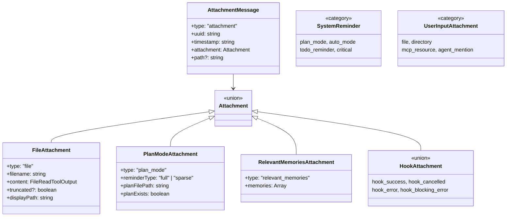
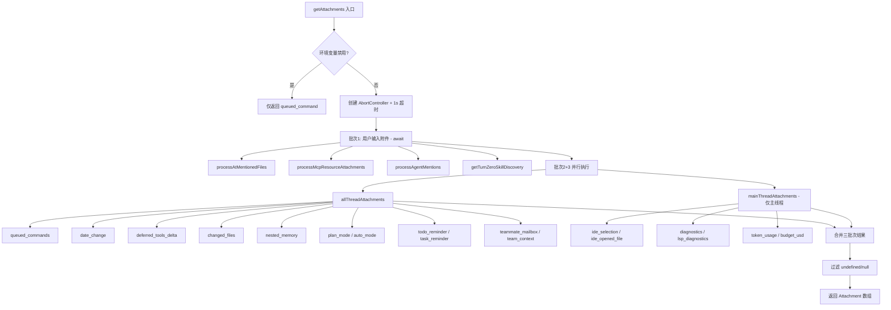
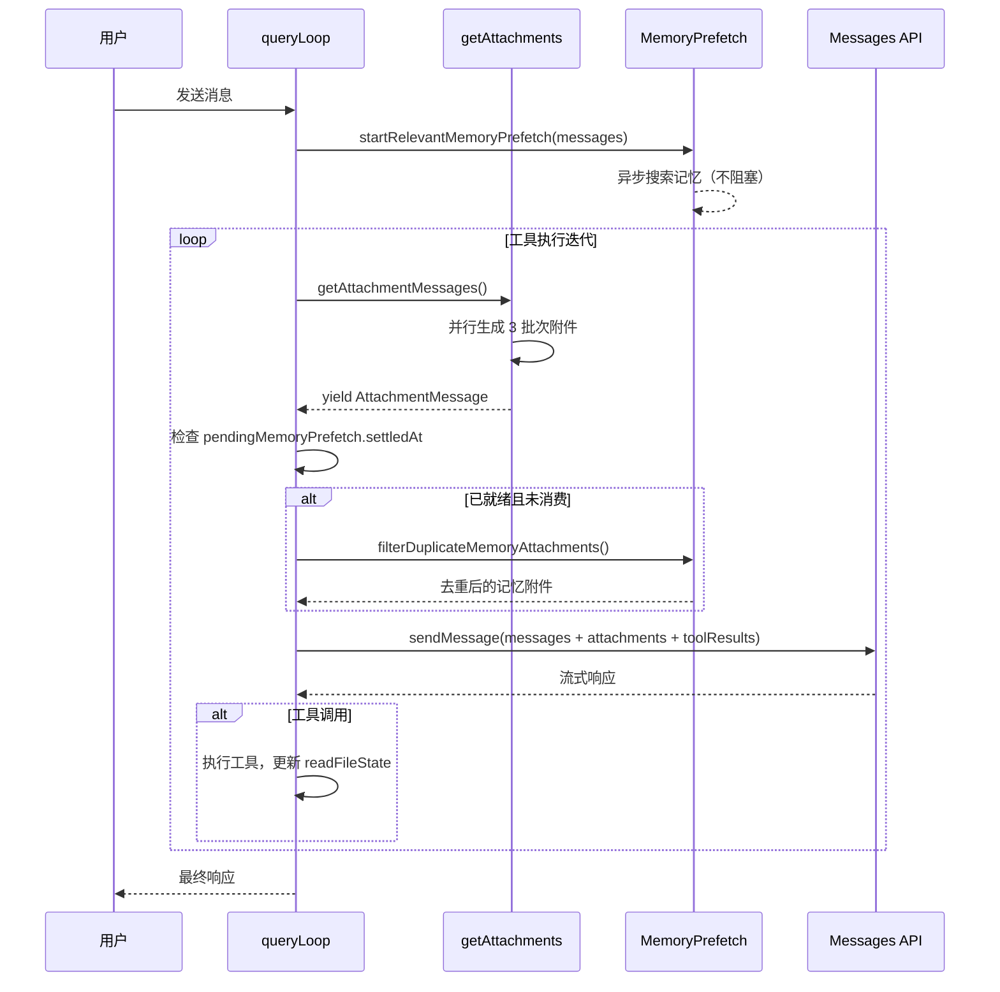
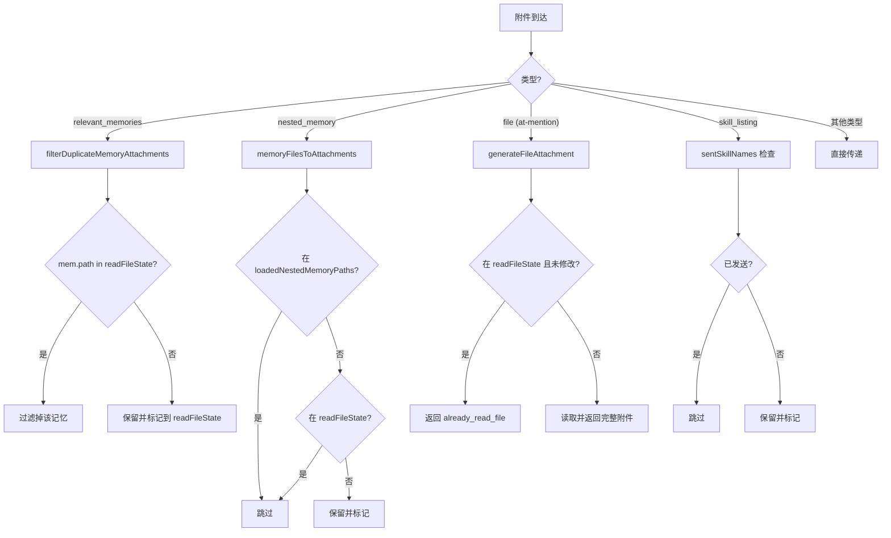

# Claude Code 附件系统 (Attachment System) 深度分析

> 基于源码分析，涵盖 50+ 种附件类型、生成流程、异步 prefetch 机制、去重过滤逻辑。

## 目录

1. [整体架构](#1-整体架构)
2. [附件完整类型列表](#2-附件完整类型列表)
3. [附件生成的完整流程](#3-附件生成的完整流程)
4. [异步 Prefetch 机制](#4-异步-prefetch-机制)
5. [附件去重和过滤逻辑](#5-附件去重和过滤逻辑)
6. [附件在消息中的注入位置](#6-附件在消息中的注入位置)
7. [附件优先级和频率控制](#7-附件优先级和频率控制)

---

## 1. 整体架构

附件系统的核心类型定义在两个文件中：
- **`src/types/message.ts`**: 定义了 `AttachmentMessage` 基类
- **`src/utils/attachments.ts`**: 定义了 50+ 种具体 `Attachment` 联合类型

`Attachment` 是一个由 50+ 种类型构成的 **Discriminated Union**（判别联合体），由 `type` 字段区分。

### 附件类型类图



---

## 2. 附件完整类型列表

### A. 用户输入触发的附件

| type | 触发条件 | 来源函数 |
|------|----------|----------|
| `file` | `@file.txt` 提及文件 | `processAtMentionedFiles` |
| `directory` | `@dir/` 提及目录 | `processAtMentionedFiles` |
| `pdf_reference` | 大型 PDF 被 `@` 提及（页数超阈值） | `tryGetPDFReference` |
| `already_read_file` | 已在上下文中的文件被再次提及 | `generateFileAttachment` |
| `mcp_resource` | `@server:uri` 引用 MCP 资源 | `processMcpResourceAttachments` |
| `agent_mention` | `@agent-xxx` 或 `@"xxx (agent)"` | `processAgentMentions` |
| `skill_discovery` | Turn-0 的技能发现 | `getTurnZeroSkillDiscovery` |
| `queued_command` | 排队的用户命令或任务通知 | `getQueuedCommandAttachments` |
| `ultrathink_effort` | 用户输入含 ultrathink 关键词 | `getUltrathinkEffortAttachment` |

### B. 自动触发的附件

| type | 触发条件 | 来源函数 |
|------|----------|----------|
| `nested_memory` | 访问子目录文件时加载对应 CLAUDE.md | `getNestedMemoryAttachments` |
| `relevant_memories` | Auto-memory 中相关记忆（异步 prefetch） | `startRelevantMemoryPrefetch` |
| `dynamic_skill` | 文件操作发现 SKILL.md 目录 | `getDynamicSkillAttachments` |
| `skill_listing` | 技能列表 | `getSkillListingAttachments` |
| `edited_text_file` | 上下文文件被外部修改（文本 diff） | `getChangedFiles` |
| `edited_image_file` | 上下文图片被外部修改 | `getChangedFiles` |
| `date_change` | 日期跨天 | `getDateChangeAttachments` |
| `diagnostics` | IDE 诊断通过 MCP 推送 | `getDiagnosticAttachments` |
| `lsp_diagnostics` | LSP 服务器诊断 | `getLSPDiagnosticAttachments` |
| `async_hook_response` | 异步 Hook 执行完成 | `getAsyncHookResponseAttachments` |
| `deferred_tools_delta` | ToolSearch 工具列表变更 | `getDeferredToolsDeltaAttachment` |
| `agent_listing_delta` | Agent 列表变更 | `getAgentListingDeltaAttachment` |
| `mcp_instructions_delta` | MCP 服务器指令变更 | `getMcpInstructionsDeltaAttachment` |
| `compaction_reminder` | 上下文窗口使用超 25% | `getCompactionReminderAttachment` |
| `context_efficiency` | 上下文效率提醒 | `getContextEfficiencyAttachment` |

### C. 系统提醒附件

| type | 触发条件 | 频率控制 |
|------|----------|----------|
| `plan_mode` | 权限模式为 `plan` | 每 5 个人类轮次提醒一次 |
| `plan_mode_exit` | 退出 plan mode | 一次性通知 |
| `auto_mode` | 权限模式为 `auto` | 每 5 个人类轮次提醒一次 |
| `auto_mode_exit` | 退出 auto mode | 一次性通知 |
| `todo_reminder` | TodoWrite 工具 10 轮未使用 | 每 10 轮提醒一次 |
| `task_reminder` | TaskUpdate 工具 10 轮未使用 | 每 10 轮提醒一次 |
| `critical_system_reminder` | 关键系统提醒 | 触发条件触发 |
| `verify_plan_reminder` | 计划执行验证提醒 | 每 10 轮 |
| `output_style` | 非默认输出风格 | 每轮 |

### D. 队友/团队附件（Swarm 模式）

| type | 触发条件 |
|------|----------|
| `teammate_mailbox` | 队友邮箱未读消息 |
| `team_context` | 队友首次轮注入团队上下文 |

### E. Hook 附件

`hook_blocking_error`, `hook_cancelled`, `hook_success`, `hook_non_blocking_error`, `hook_error_during_execution`, `hook_stopped_continuation`, `hook_additional_context`, `hook_system_message`, `hook_permission_decision`, `async_hook_response`

### F. 监控/预算附件

`token_usage`, `budget_usd`, `output_token_usage`

### G. 已读文件/紧凑引用

`compact_file_reference`, `selected_lines_in_ide`, `opened_file_in_ide`

---

## 3. 附件生成的完整流程

### 并行执行架构



每个附件生成器都被 `maybe()` 包装，提供错误隔离和性能遥测。

---

## 4. 异步 Prefetch 机制

### 4.1 相关记忆 Prefetch

**生命周期:**
1. **启动**: 用户轮次开始时 `using pendingMemoryPrefetch = startRelevantMemoryPrefetch()`
2. **执行**: 异步搜索 auto-memory 目录
3. **收集**: 工具执行完成后检查 `settledAt !== null`
4. **去重**: 通过 `filterDuplicateMemoryAttachments()` 过滤
5. **释放**: `using` 语法确保 dispose

**关键设计:**
- 不阻塞主循环，未就绪则跳过
- 会话级节流: `MAX_SESSION_BYTES = 60KB`
- 每文件上限: 200 行 / 4KB

### 4.2 技能发现 Prefetch

- 基于 write-pivot 检测触发
- Turn-0 特例: 同步执行（blocking）

### 附件注入时序图



---

## 5. 附件去重和过滤逻辑

### 去重决策树



**关键去重机制:**
- `readFileState`: 100 条目 LRU 缓存
- `loadedNestedMemoryPaths`: 永不驱逐的 Set
- `sentSkillNames`: 按 agentId 分区的 Map
- compact 后自然重置 readFileState，允许记忆重新浮现

---

## 6. 附件在消息中的注入位置

### 转换链

```
Attachment (数据对象)
    ↓  createAttachmentMessage()
AttachmentMessage (消息包装)
    ↓  normalizeAttachmentForAPI()
UserMessage[] (API 格式，含 <system-reminder> 标签)
    ↓  mergeUserMessages + smooshSystemReminderSiblings
最终 API 消息数组
```

### 渲染模式

| 附件类别 | 渲染方式 |
|----------|----------|
| 文件类 | 模拟 `FileReadTool` 的 tool_use + tool_result 对 |
| 文本类 | 包裹在 `<system-reminder>` 标签中 |
| 目录 | 模拟 `BashTool` 的 `ls` 命令 |
| 计划模式 | 多条系统消息（完整 5 阶段工作流或稀疏提醒） |

---

## 7. 附件优先级和频率控制

| 附件类型 | 频率控制 |
|----------|----------|
| Plan Mode 提醒 | 每 5 个人类轮次，首次无条件提醒 |
| Auto Mode 提醒 | 每 5 个人类轮次，退出重置计数 |
| Todo/Task 提醒 | 10 轮未使用后提醒，每 10 轮一次 |
| 记忆 Session 预算 | `MAX_SESSION_BYTES = 60KB`，每文件 200 行 / 4KB |
| 全局禁用 | `CLAUDE_CODE_DISABLE_ATTACHMENTS` 或 `CLAUDE_CODE_SIMPLE` |

### 关键架构决策

1. **并行 + maybe 包装**: 所有附件生成器独立并行执行，通过 `maybe()` 隔离错误
2. **Prefetch 模式**: Memory 和 Skill Discovery 使用 Disposable 模式，启动后不阻塞
3. **双层去重**: `loadedNestedMemoryPaths`（永不驱逐 Set）+ `readFileState`（LRU 100 条目）
4. **会话级预算**: 记忆有 `MAX_SESSION_BYTES=60KB` 上限，compact 后自然重置
5. **`<system-reminder>` 标签**: 所有附件渲染为 `UserMessage`，包裹在标签中

---

## 关键源码位置速查

| 功能 | 核心函数 | 文件 |
|------|----------|------|
| 附件入口 | `getAttachments()` | `attachments.ts` |
| 附件消息生成 | `getAttachmentMessages()` | `attachments.ts` |
| 文件附件 | `generateFileAttachment()` | `attachments.ts` |
| 记忆去重 | `filterDuplicateMemoryAttachments()` | `attachments.ts` |
| 记忆 Prefetch | `startRelevantMemoryPrefetch()` | `attachments.ts` |
| 技能 Prefetch | `startSkillDiscoveryPrefetch()` | `skillSearch/prefetch.ts` |
| API 渲染 | `normalizeAttachmentForAPI()` | `attachments.ts` |
