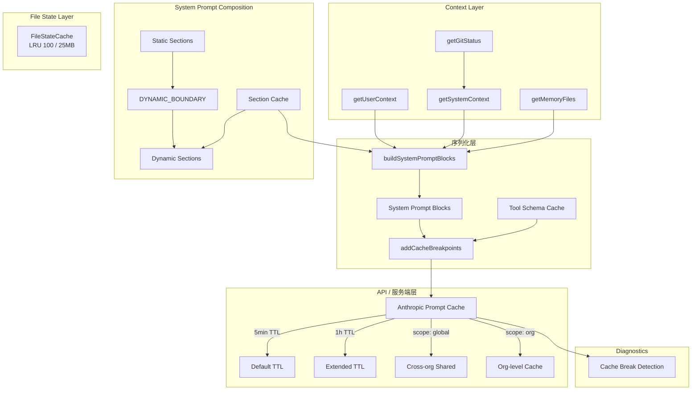
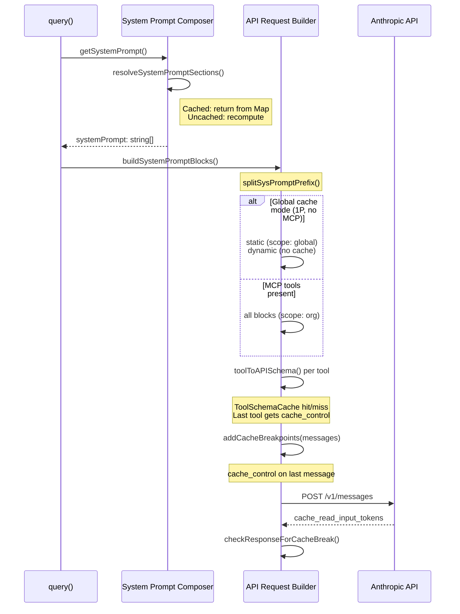
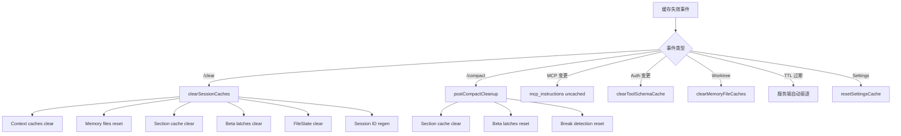

# Claude Code 缓存策略 (Caching Strategy) 深度分析

> 基于源码分析，涵盖 Prompt Caching、System Prompt Section Cache、Context Cache、Tool Schema Cache、FileStateCache 等六层缓存体系。

## 目录

1. [总体架构概览](#1-总体架构概览)
2. [Prompt Caching（API 层提示词缓存）](#2-prompt-cachingapi-层提示词缓存)
3. [System Prompt Section Cache](#3-system-prompt-section-cache)
4. [Context 缓存（memoize 层）](#4-context-缓存memoize-层)
5. [Tool Schema Cache](#5-tool-schema-cache)
6. [FileStateCache（文件状态缓存）](#6-filestatecache文件状态缓存)
7. [Beta Header Latch 机制](#7-beta-header-latch-机制)
8. [缓存命中检测与诊断](#8-缓存命中检测与诊断)
9. [缓存失效策略总览](#9-缓存失效策略总览)
10. [缓存对 API 成本的影响](#10-缓存对-api-成本的影响)

---

## 1. 总体架构概览

Claude Code 的缓存系统分为 **六个层次**：



---

## 2. Prompt Caching（API 层提示词缓存）

### 2.1 核心原理

利用 Anthropic API 的 Prompt Caching，在请求中标记 `cache_control: { type: 'ephemeral' }`，使服务端缓存系统提示词和工具 schema 的 KV 缓存。

### 2.2 静态 vs 动态内容分界

`SYSTEM_PROMPT_DYNAMIC_BOUNDARY` 将系统提示词分为两部分：

| 类型 | 内容 | 缓存策略 |
|------|------|----------|
| **静态** | 角色定义、系统行为、任务指导、操作安全、工具使用、风格、效率 | scope: 'global'（1P）或 'org'（3P） |
| **动态** | 会话指导、记忆、环境信息、语言、输出风格、MCP 指令 | 不缓存或 org scope |

### 2.3 `splitSysPromptPrefix` 拆分逻辑

```typescript
type SystemPromptBlock = {
  text: string
  cacheScope: CacheScope | null  // 'global' | 'org' | null
}
```

| 条件 | 模式 | cacheScope |
|------|------|-----------|
| MCP 工具存在 | Tool-based | attribution: null, prefix: 'org', rest: 'org' |
| 1P + 边界标记 | Global cache | static: **'global'**, dynamic: null |
| 默认（3P） | Org cache | prefix: 'org', rest: 'org' |

### API 请求缓存标记放置流程



### 2.4 1 小时 TTL

```typescript
export function getCacheControl({ scope, querySource }) {
  return {
    type: 'ephemeral',
    ...(should1hCacheTTL(querySource) && { ttl: '1h' }),
    ...(scope === 'global' && { scope }),
  }
}
```

资格和白名单在首次评估后 **锁存在 bootstrap state** 中，防止会话中途 TTL 切换破坏缓存。

---

## 3. System Prompt Section Cache

### 3.1 实现原理

```typescript
// 普通段落：计算一次后缓存
systemPromptSection(name, compute)
// 危险段落：每轮重新计算
DANGEROUS_uncachedSystemPromptSection(name, compute, reason)
```

缓存存储在 `STATE.systemPromptSectionCache: Map<string, string | null>`。

### 3.2 缓存状态

| 段落名 | 类型 | 原因 |
|--------|------|------|
| `session_guidance` | cached | 启动后不变 |
| `memory` | cached | CLAUDE.md 会话内稳定 |
| `env_info_simple` | cached | 环境信息不变 |
| `language` / `output_style` | cached | 设置不变 |
| `mcp_instructions` | **DANGEROUS_uncached** | MCP 可中途连接/断开 |
| `scratchpad` | cached | 会话内不变 |

失效：`/clear`、`/compact`、auto-compaction 时调用 `clearSystemPromptSections()`。

---

## 4. Context 缓存（memoize 层）

### 4.1 getUserContext() 和 getSystemContext()

使用 lodash `memoize`，无参数函数只有一个缓存条目：

| 函数 | 缓存内容 | 失效条件 |
|------|----------|----------|
| `getUserContext()` | CLAUDE.md + 日期 | `/clear`, `/compact`, injection change |
| `getSystemContext()` | gitStatus + cacheBreaker | `/clear`, `/compact`, injection change |
| `getMemoryFiles()` | 所有内存文件 | `/clear`, `/compact`, worktree, settings |
| `getGitStatus()` | git 状态快照 | `/clear` |

### 4.2 getMemoryFiles() 失效策略

两个入口：
1. `clearMemoryFileCaches()` — 仅清除缓存，不触发 hook
2. `resetGetMemoryFilesCache(reason)` — 清除 + 触发 InstructionsLoaded hook

---

## 5. Tool Schema Cache

### 5.1 实现原理

会话级 Map 缓存，防止 GrowthBook 翻转或 MCP 重连导致 schema 字节变化：

```typescript
const TOOL_SCHEMA_CACHE = new Map<string, CachedSchema>()
```

缓存键：
- 普通工具：`tool.name`
- 带 inputJSONSchema 的工具：`tool.name + ":" + JSON.stringify(inputJSONSchema)`

Schema 在首次渲染后锁定，后续请求只叠加 per-request overlay（`defer_loading`、`cache_control`）。

### Tool Schema Cache 生命周期

```mermaid
stateDiagram-v2
    [*] --> Empty: Session Start
    Empty --> Cached: First toolToAPISchema()
    note right of Cached: Base schema:<br/>name, description, input_schema,<br/>strict, eager_input_streaming

    Cached --> Cached: Same key (HIT)
    Cached --> Cached: New key (MISS, compute+store)
    Cached --> Empty: Auth state change

    Cached --> [*]: Session End
```

---

## 6. FileStateCache（文件状态缓存）

基于 **LRU Cache** 实现：

```typescript
export class FileStateCache {
  private cache: LRUCache<string, FileState>
  // max: 100 entries, maxSize: 25MB
}
```

| 特性 | 说明 |
|------|------|
| 路径标准化 | `path.normalize()` 处理 |
| 大小限制 | 25MB 上限 |
| LRU 驱逐 | 超过 100 条目时自动驱逐 |
| 图片不缓存 | FileReadTool 不缓存图片 |

被 `FileReadTool`、`FileEditTool`、`FileWriteTool`、`BashTool`、`compact.ts` 使用。

---

## 7. Beta Header Latch 机制

某些功能的启用/禁用会改变 beta headers，header 变化会破坏服务端 prompt cache key。解决方案是 **sticky-on latch**：

| Latch | 保护的 Header | 触发条件 | 复位 |
|-------|--------------|---------|------|
| `afkModeHeaderLatched` | AFK Mode | auto mode 首次激活 | `/clear`, `/compact` |
| `fastModeHeaderLatched` | Fast Mode | fast mode 首次启用 | `/clear`, `/compact` |
| `cacheEditingHeaderLatched` | Cache Editing | cached MC 首次启用 | `/clear`, `/compact` |
| `thinkingClearLatched` | Thinking Clear | idle > 1h | `/clear`, `/compact` |

核心思想：**一旦启用，会话内永远保持发送该 header**，避免 toggle 破坏 ~50-70K token 的 prompt cache。

---

## 8. 缓存命中检测与诊断

`promptCacheBreakDetection.ts` 实现完整的缓存命中分析：

### Phase 1 - 记录状态
`recordPromptState()` — 对 12 个维度计算哈希，与上次对比。

### Phase 2 - 检查响应
`checkResponseForCacheBreak()` — 如果 cache read token 下降 >5% 且 >2000 tokens，判定为缓存中断。

### 跟踪的 12 个维度

1. 系统提示词哈希
2. 工具 schema 哈希
3. 模型
4. Fast mode 状态
5. cache_control scope/TTL
6. 全局缓存策略
7. Beta headers
8. Auto mode 状态
9. Overage 状态
10. Cached microcompact 状态
11. Effort 值
12. Extra body params

---

## 9. 缓存失效策略总览



### /clear 影响

| 缓存 | 清除 |
|------|------|
| Context caches | **是** |
| Memory files | **是** |
| Section cache | **是** |
| Beta latches | **是** |
| FileStateCache | **是** |
| toolSchemaCache | **否**（认证不变） |
| 会话 ID | **重新生成** |

---

## 10. 缓存对 API 成本的影响

### 定价模型

| 类型 | 相对成本 |
|------|----------|
| Cache write | 比普通 input 贵 25% |
| Cache read | 比普通 input 便宜 **90%** |
| Cache miss | 等同普通 input |

### 收益估算

- 系统提示词 + 工具 schema：~11K-20K tokens
- 缓存命中时节省约 90%
- 1h TTL 避免 autonomous mode 下频繁重建
- Global cache 使 ~5K-8K 静态指令边际成本极低

---

## 关键源码文件索引

| 文件 | 职责 |
|------|------|
| `src/utils/api.ts` | `splitSysPromptPrefix()`, `toolToAPISchema()` |
| `src/constants/prompts.ts` | `SYSTEM_PROMPT_DYNAMIC_BOUNDARY` |
| `src/constants/systemPromptSections.ts` | 段落级缓存 |
| `src/bootstrap/state.ts` | section cache, beta latches |
| `src/context.ts` | memoize 缓存 |
| `src/utils/claudemd.ts` | getMemoryFiles memoize |
| `src/utils/toolSchemaCache.ts` | Tool Schema Cache |
| `src/utils/fileStateCache.ts` | FileStateCache LRU |
| `src/services/api/claude.ts` | 缓存控制和 API 请求构建 |
| `src/services/api/promptCacheBreakDetection.ts` | 缓存命中检测 |
| `src/commands/clear/caches.ts` | 统一缓存清除 |
