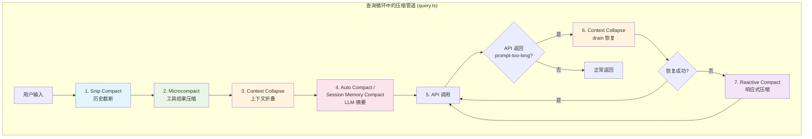
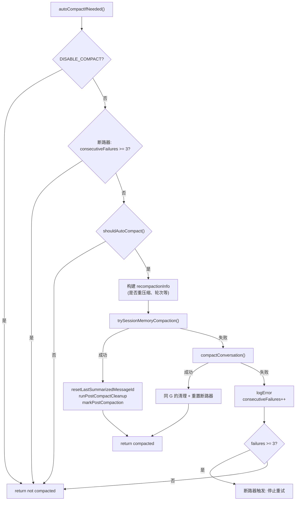
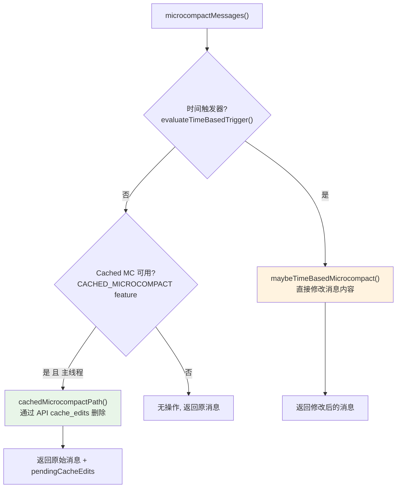
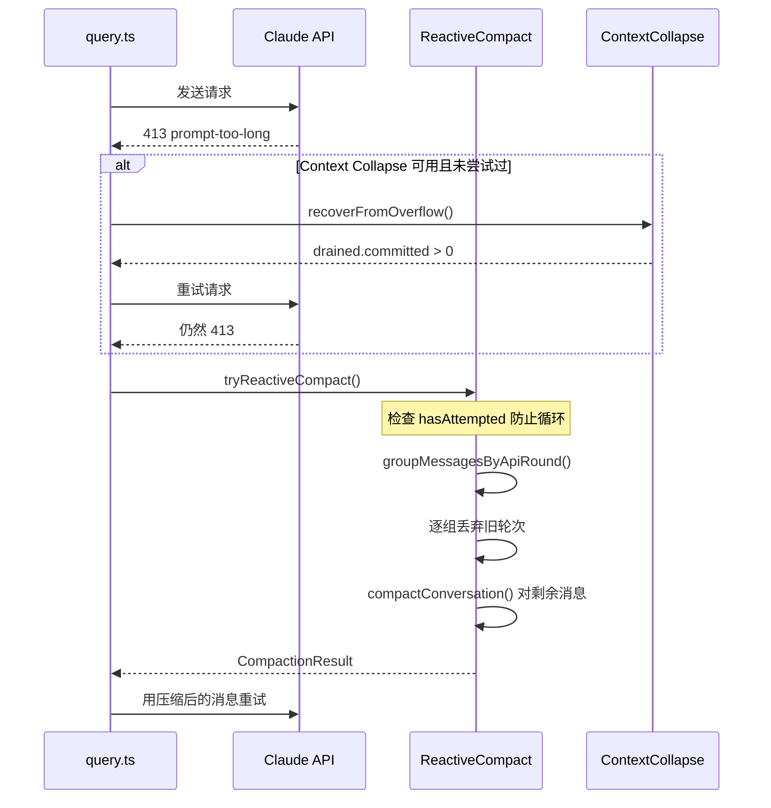
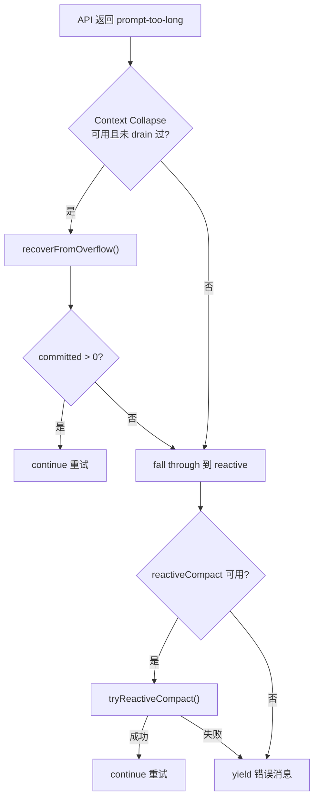
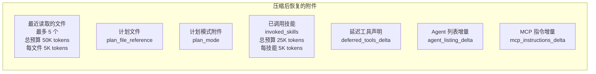
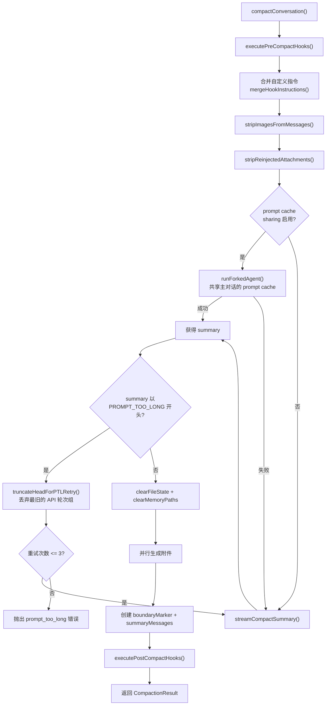
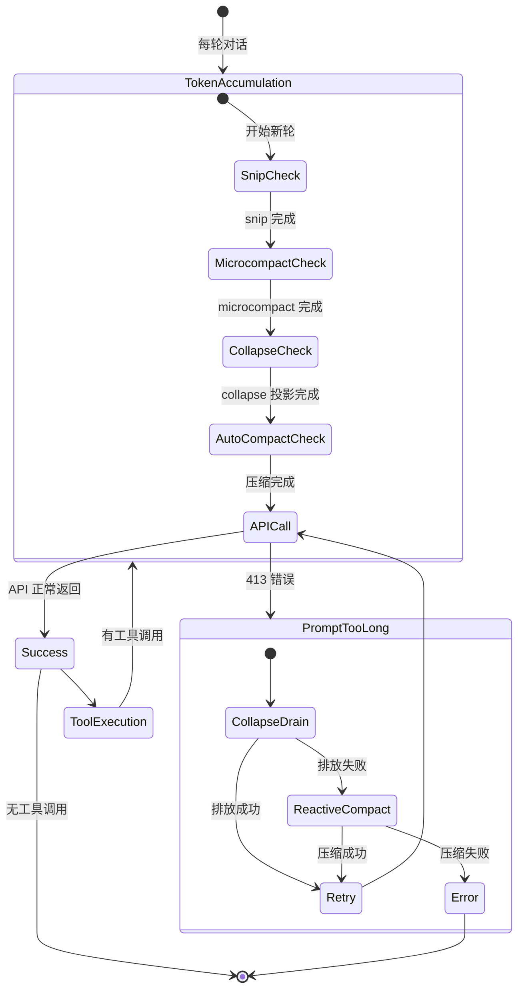

# Claude Code 上下文压缩（Compaction）机制深度分析

> 基于源码分析，涵盖自动压缩、Session Memory 压缩、Microcompact、Snip Compact、Reactive Compact、Context Collapse 等所有压缩机制。

## 目录

1. [架构总览](#1-架构总览)
2. [自动压缩 (AutoCompact)](#2-自动压缩-autocompact)
3. [Session Memory 压缩](#3-session-memory-压缩)
4. [Microcompact（工具结果级压缩）](#4-microcompact工具结果级压缩)
5. [Snip Compact（历史截断）](#5-snip-compact历史截断)
6. [Reactive Compact（响应式压缩）](#6-reactive-compact响应式压缩)
7. [Context Collapse（上下文折叠）](#7-context-collapse上下文折叠)
8. [API 级别的 context_management](#8-api-级别的-context_management)
9. [压缩后的消息重组](#9-压缩后的消息重组)
10. [核心压缩流程（compactConversation）](#10-核心压缩流程compactconversation)
11. [各机制关系与优先级](#11-各机制关系与优先级)

---

## 1. 架构总览

Claude Code 的上下文管理采用**多层压缩策略**，从细粒度到粗粒度逐级递进。核心入口在 `src/query.ts` 的主查询循环中，执行顺序如下：

```
snipCompact → microcompact → contextCollapse → autoCompact → API call → reactiveCompact(失败时)
```

关键文件分布：

| 文件 | 职责 |
|------|------|
| `src/query.ts` | 主查询循环，编排所有压缩步骤 |
| `src/services/compact/autoCompact.ts` | 自动压缩触发逻辑与阈值计算 |
| `src/services/compact/compact.ts` | 核心压缩实现（LLM 摘要） |
| `src/services/compact/microCompact.ts` | 工具结果级细粒度压缩 |
| `src/services/compact/sessionMemoryCompact.ts` | 基于会话记忆的轻量压缩 |
| `src/services/compact/snipCompact.ts` | 历史截断（feature-gated） |
| `src/services/compact/reactiveCompact.ts` | 响应式压缩（feature-gated） |
| `src/services/compact/apiMicrocompact.ts` | API 级别的上下文管理策略 |
| `src/services/compact/prompt.ts` | 压缩提示词模板 |
| `src/services/compact/grouping.ts` | 消息按 API 轮次分组 |
| `src/services/compact/postCompactCleanup.ts` | 压缩后状态清理 |
| `src/services/contextCollapse/index.ts` | 上下文折叠（feature-gated） |
| `src/utils/context.ts` | 上下文窗口大小计算 |

### 压缩层次总览图



---

## 2. 自动压缩 (AutoCompact)

### 2.1 触发条件与阈值计算

**核心函数**: `src/services/compact/autoCompact.ts` 中的 `shouldAutoCompact()`

阈值计算链：

```
contextWindow = getContextWindowForModel(model)        // 默认 200K，1M 模型为 1M
reservedForSummary = min(maxOutputTokens, 20000)       // 为压缩输出预留
effectiveContextWindow = contextWindow - reservedForSummary
autoCompactThreshold = effectiveContextWindow - 13000   // AUTOCOMPACT_BUFFER_TOKENS
```

以默认 200K 模型为例：
- `effectiveContextWindow` = 200000 - 20000 = 180000
- `autoCompactThreshold` = 180000 - 13000 = **167000 tokens**

额外的环境变量覆盖：
- `CLAUDE_AUTOCOMPACT_PCT_OVERRIDE`: 以百分比设置阈值
- `CLAUDE_CODE_AUTO_COMPACT_WINDOW`: 强制限制上下文窗口大小

### 2.2 守卫条件

`shouldAutoCompact()` 返回 `false` 的场景：

1. **递归防护**: `querySource` 为 `session_memory`、`compact`、`marble_origami` 时跳过（防止死锁）
2. **功能开关**: `DISABLE_COMPACT` 或 `DISABLE_AUTO_COMPACT` 环境变量
3. **用户配置**: `userConfig.autoCompactEnabled` 为 false
4. **Reactive-only 模式**: GrowthBook 标志 `tengu_cobalt_raccoon` 为 true 时，抑制主动压缩
5. **Context Collapse 模式**: `isContextCollapseEnabled()` 为 true 时，autocompact 被抑制（collapse 在 90% commit / 95% blocking，autocompact 在 ~93% 触发，会竞态冲突）

### 2.3 执行流程



### 2.4 断路器机制

为防止单次会话中大量连续失败的压缩尝试浪费 API 调用：
- `MAX_CONSECUTIVE_AUTOCOMPACT_FAILURES = 3`
- 每次失败递增 `consecutiveFailures`，成功时重置为 0

### 2.5 阈值体系

| 常量 | 值 | 用途 |
|------|-----|------|
| `AUTOCOMPACT_BUFFER_TOKENS` | 13,000 | 自动压缩触发缓冲区 |
| `WARNING_THRESHOLD_BUFFER_TOKENS` | 20,000 | 警告阈值缓冲区 |
| `ERROR_THRESHOLD_BUFFER_TOKENS` | 20,000 | 错误阈值缓冲区 |
| `MANUAL_COMPACT_BUFFER_TOKENS` | 3,000 | 手动压缩阻塞阈值 |

---

## 3. Session Memory 压缩

**文件**: `src/services/compact/sessionMemoryCompact.ts`

Session Memory Compact 是一种**轻量级替代方案**，用已有的会话记忆文件代替 LLM 生成摘要。

### 3.1 工作原理

与传统 compact 需要调用 LLM 生成摘要不同，Session Memory Compact：
1. 读取已有的 session memory 文件（由后台 session memory extraction 任务维护）
2. 保留最近 N 条消息（基于 token 和消息数阈值）
3. 使用 session memory 内容作为压缩摘要

### 3.2 配置参数

```typescript
DEFAULT_SM_COMPACT_CONFIG = {
  minTokens: 10_000,        // 最少保留 10K tokens
  minTextBlockMessages: 5,   // 最少保留 5 条含文本的消息
  maxTokens: 40_000,         // 最多保留 40K tokens
}
```

远程配置通过 GrowthBook `tengu_sm_compact_config` 动态更新。

### 3.3 消息保留计算

`calculateMessagesToKeepIndex()` 的算法：
1. 从 `lastSummarizedMessageId` 之后开始
2. 向后扩展直到满足 `minTokens` 和 `minTextBlockMessages` 双重下限
3. 达到 `maxTokens` 时停止
4. 调用 `adjustIndexToPreserveAPIInvariants()` 确保不拆分 `tool_use/tool_result` 对

### 3.4 优先级

在 `autoCompactIfNeeded()` 中，Session Memory Compact **优先于**传统 compact 尝试。

---

## 4. Microcompact（工具结果级压缩）

**文件**: `src/services/compact/microCompact.ts`

Microcompact 在工具结果级别进行细粒度压缩，不影响对话结构，只替换或删除工具输出内容。

### 4.1 两种路径



### 4.2 可压缩工具列表

```typescript
COMPACTABLE_TOOLS = [
  'Read',      // 文件读取
  'Bash',      // Shell 命令（所有变体）
  'Grep',      // 搜索
  'Glob',      // 文件匹配
  'WebSearch', // 网页搜索
  'WebFetch',  // 网页获取
  'Edit',      // 文件编辑
  'Write',     // 文件写入
]
```

### 4.3 时间触发 Microcompact

**触发条件**（`evaluateTimeBasedTrigger()`）：
- 上次 assistant 消息的时间戳距现在超过 `gapThresholdMinutes`（默认 60 分钟）
- 仅主线程触发（`querySource` 以 `repl_main_thread` 开头）
- GrowthBook 配置 `tengu_slate_heron` 中 `enabled = true`

**压缩策略**：
- 保留最近 `keepRecent`（默认 5）个可压缩工具的结果
- 将其余工具结果内容替换为 `'[Old tool result content cleared]'`
- **直接修改消息内容**（因为缓存已冷，无需保持缓存一致性）

**设计理由**：超过 60 分钟的间隔意味着服务端 prompt cache 已过期（TTL = 1 小时），完整前缀会被重写。提前清除旧工具结果可以减少重写量。

### 4.4 Cached Microcompact（缓存编辑型）

**核心差异**：
- **不修改本地消息内容** — `cache_reference` 和 `cache_edits` 在 API 层添加
- 使用**计数阈值**（不是 token 阈值）：基于 GrowthBook 配置的 `triggerThreshold` 和 `keepRecent`
- 通过 `cache_edits` API 参数在服务端删除缓存中的工具结果，**不破坏缓存前缀**

**流程**：
1. 扫描消息，收集所有 `tool_use` ID（限 `COMPACTABLE_TOOLS`）
2. 注册新发现的工具结果到 `cachedMCState`
3. 当注册数量超过 `triggerThreshold` 时，触发删除
4. 创建 `cache_edits` 块，存入 `pendingCacheEdits`
5. API 调用时携带 `cache_edits`，服务端执行删除
6. API 响应后，从 `usage.cache_deleted_input_tokens` 获取实际删除的 token 数

**限制**：仅支持 `firstParty` API 提供商，仅主线程。

---

## 5. Snip Compact（历史截断）

**文件**: `src/services/compact/snipCompact.ts`

在当前构建中是 **feature-gated 的 stub**（`HISTORY_SNIP`）。

Snip 在 microcompact 之前运行，两者不是互斥的。Snip 移除消息并返回 `tokensFreed`，使后续 autocompact 的阈值检查能反映真实节省量。

---

## 6. Reactive Compact（响应式压缩）

### 6.1 触发时机

Reactive Compact **不是主动触发的**，而是作为 API 调用失败后的**恢复机制**：



### 6.2 恢复流程



### 6.3 互斥关系

- Reactive-only 模式（`tengu_cobalt_raccoon = true`）完全抑制主动 autocompact
- 当两者都启用时，preemptive blocking 检查被跳过

---

## 7. Context Collapse（上下文折叠）

**文件**: `src/services/contextCollapse/index.ts`

在当前构建中是 **feature-gated stub**。

### 设计意图

Context Collapse 是 autocompact 的**替代方案**：
- **90% commit**: 开始提交折叠（压缩旧上下文）
- **95% blocking-spawn**: 阻止新子 agent 的生成
- Autocompact 在 ~93% 触发，恰好位于两者之间，会与 collapse 竞态

因此当 collapse 启用时，autocompact 被**完全抑制**。

---

## 8. API 级别的 context_management

**文件**: `src/services/compact/apiMicrocompact.ts`

这是在 API 请求体中传递的**服务端上下文管理策略**，由 API 服务端执行。

### 策略类型

| 策略 | 用途 | 配置 |
|------|------|------|
| `clear_tool_uses_20250919` | 清除工具使用记录 | 触发阈值 180K tokens，保留最近 40K |
| `clear_thinking_20251015` | 清除思考块 | 正常保留全部，idle 1h+ 保留最后 1 轮 |

需要 `CONTEXT_MANAGEMENT_BETA_HEADER` beta 标志才能生效。

---

## 9. 压缩后的消息重组

### 消息结构

```
[boundaryMarker] + [summaryMessages...] + [messagesToKeep...] + [attachments...] + [hookResults...]
```

### Post-Compact 附件恢复



---

## 10. 核心压缩流程（compactConversation）

### 完整流程



### 两种执行路径

| 路径 | 条件 | 特点 |
|------|------|------|
| **Forked Agent** | 默认启用 | 复用主对话 prompt cache，`maxTurns: 1`，`skipCacheWrite: true` |
| **Streaming** | fallback | 独立 API 请求，禁用 thinking，`maxOutputTokens = min(20000, 模型上限)` |

### 摘要后处理

原始 LLM 输出格式：
```xml
<analysis>[草稿分析]</analysis>
<summary>[结构化摘要]</summary>
```

`formatCompactSummary()` 剥离 `<analysis>`，提取 `<summary>`，替换为 `Summary:` 标题。

---

## 11. 各机制关系与优先级

### 完整状态图



### 优先级与互斥关系

| 优先级 | 机制 | 触发条件 | 互斥关系 |
|--------|------|----------|----------|
| 1 | Snip Compact | `HISTORY_SNIP` feature | 与后续共存 |
| 2 | Microcompact (Time) | idle > 60min | 短路 Cached MC |
| 3 | Microcompact (Cached) | 工具结果数超阈值 | 与 time-based 互斥 |
| 4 | Context Collapse | `CONTEXT_COLLAPSE` feature | 抑制 AutoCompact |
| 5a | Session Memory Compact | SM feature flags | 优先于 Legacy |
| 5b | Auto Compact | tokens > threshold | SM 失败后 fallback |
| 6 | Reactive Compact | API 413 错误 | 最后恢复手段 |

---

## 关键源码速查

| 机制 | 核心函数 | 文件 |
|------|----------|------|
| 阈值计算 | `getAutoCompactThreshold()` | `autoCompact.ts` |
| 触发判断 | `shouldAutoCompact()` | `autoCompact.ts` |
| 核心压缩 | `compactConversation()` | `compact.ts` |
| Microcompact 入口 | `microcompactMessages()` | `microCompact.ts` |
| Session Memory 压缩 | `trySessionMemoryCompaction()` | `sessionMemoryCompact.ts` |
| API 上下文管理 | `getAPIContextManagement()` | `apiMicrocompact.ts` |
| 压缩后清理 | `runPostCompactCleanup()` | `postCompactCleanup.ts` |
| 上下文窗口计算 | `getContextWindowForModel()` | `context.ts` |
| 查询循环编排 | query.ts 主循环 | `query.ts` |
