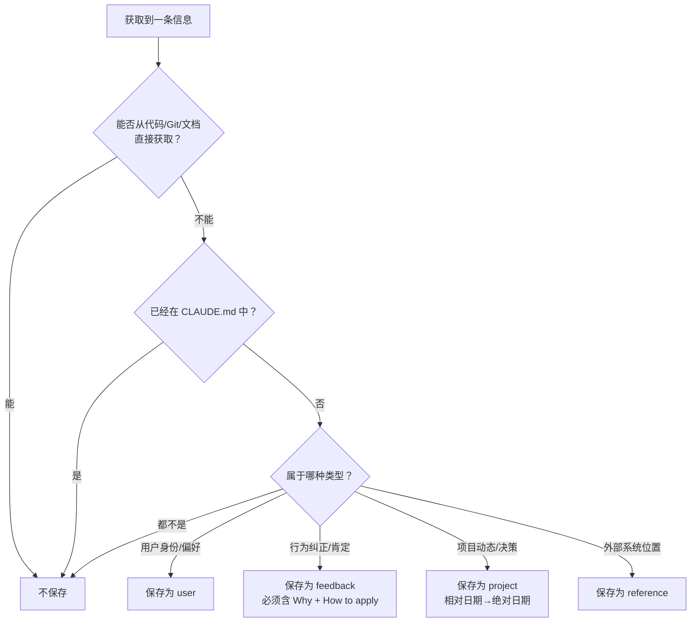

# claude code的记忆系统

## 1.1 记忆系统的设计原则

只记忆从当前项目状态不可立即获知的信息。

记忆有四种类型：

1. user:用户画像记忆，包括：用户的身份、偏好、领域、背景。
2. feedback：用户对Agent行为的反馈，同时记录正向和负向反馈。
3. project：项目的目标、进展、截止日期等。
4. reference：外部系统的参考信息。

feedback和project都使用结构化记忆，包含：why和how to apply。project还包含一个特殊要求，将相对时间转化为绝对时间。

明确排除的记忆：

1. 代码模式、约定、架构、文件路径、项目结构。
2. git信息，如git历史、改动、改动人。
3. 调试方案或修复记录。
4. 已经记录在claude.md中的内容。
5. 临时任务细节：进行中细项、临时状态、当前对话上下文等。

记忆的决策流程如下：获取到一条消息后，先判断是否从代码、git、文档中直接读取，如果否，则判断是否已经写在CLAUDE.md中，如果否，则再判断其类型，再按照类型写入不同的记忆类型文件。



记忆存储在项目的特定目录下：

```
~/.claude/projects/{project-hash}/memory/
├── MEMORY.md              ← 索引文件（每次会话自动加载）
├── user_role.md            ← 用户记忆
├── feedback_terse.md       ← 反馈记忆
├── project_freeze.md       ← 项目记忆
└── reference_linear.md     ← 引用记忆
```

记忆目录的位置优先级如下：

优先从CLAUDE_COWORK_MEMORY_PATH_OVERRIDE中读取，

未命中则从settings.json中的autoMemoryDirectory中读取，

未命中从.claudecode的projects目录下读取。

注意：同一仓库的git worktree共享一个记录目录。

记忆的启动判断链：

CLAUDE_CODE_DISABLE_AUTO_MEMORY环境变量->禁用

--bare启动标识->禁用

远程模式->禁用

setting.json中的autoMemoryEnable配置->按配置

默认启用

注意：MEMORY.md是索引而非原始记忆，它提供快速定位记忆本身的入口，每次会话启动时，MEMORY.md 的内容会通过 `getClaudeMds()` 自动加载到用户上下文中（与 CLAUDE.md 同一批次加载），让模型在第一个回合就知道有哪些记忆可用。MEMORY.md限制在200行、25KB以内。索引条目太多时会截断，但截断时会追加警告，警告并不只是报告问题，还**教模型如何修复**——提示模型"keep index entries to one line under ~200 chars; move detail into topic files"。

## 1.2 记忆召回

记忆的召回是预取的，即用户查询后，先把MEMORY.md输入到system数组中，但同时也会开启一个线程去读取memory目录下的所有非MEMORY.md的md文件，读取的流程主要包括：读文件 -> 格式化信息 -> sonnet查询相关性 -> 去重 -> 组装记忆。

读文件主要函数是scanMemoryFiles()，它只读每个文件的前30行，来解析frontmatter，并根据mtime进行排序，文件数上限为200个。`alreadySurfaced`会对文件进行过滤，去掉之前回合**已经作为 relevant_memories 附件注入过**的路径。

格式化信息的主要函数是formatMemoryMainfest，将记忆类型[type]、filename、mtime、description组合进行格式化，格式为：`[type] filename (timestamp): description`

sonnet查询相关性的主要函数为sideQuery, 输入是用户query+memory mainfest+recent tools，输出是`selected_memories` 文件名数组（最多 5 个，经 JSON Schema 校验）。

```system:
        as it processes a user's query. ... Return a list of filenames
        (up to 5). Only include memories you are certain will be helpful..."
user:   "Query: <用户query>

    Available memories:
        - [type] filename (mtime): description
        ...
        Recently used tools:<recentTools></recenttools>"
max_tokens: 256
output_format: { type: 'json_schema', schema: { selected_memories: [string] } }
```

去重的主要函数是alreadySurfaced和readFileState，`readFileState`将已经FileReadTool 读过的文件已展示过的文件都过滤掉，`alreadySurfaced`则再次对**已经作为 relevant_memories 附件注入过**的路径进行过滤，原因在于前一轮过滤是对单个记忆文件夹的过滤，当存在多个记忆目录时，A 目录滤掉的路径可能在 B 目录重新出现，因此仍需要过一遍alreadySurface进行兜底。

将过滤的文件组装的`relevant_memories` 附件，格式如下

```ts
{ type: 'relevant_memories', memories: [{ path, content, mtimeMs, header(年龄+路径前缀), limit? }] }
```

`header` 是**预计算**的"保存于 N 天前"字符串，这种方式可以避免 `memoryAge()` 每次 `Date.now()` 不同导致字节变化、**击穿 prompt cache**。

这些 attachment/user message 与系统提示、CLAUDE.md 内容一起被 normalizeMessagesForAPI 处理（claude.ts:1266）、addCacheBreakpoints 加缓存标记（claude.ts:3063），最终作为请求体的 messages 数组（system 里带着 CLAUDE.md/rules，messages 最新 user 里带着召回的记忆 <system-reminder></system>）发给大模型。

## 1.3 记忆新鲜度与漂移防御

### 1.3.1 时间距离可读性转换

`memoryAge.ts` 将 `mtime` 转为人类可读的字符串，例如yesterday、47 days ago，这样可以规避模型不擅长处理时间格式的缺陷。

### 1.3.2 记忆新鲜度

对于超过1天的记忆，系统会自动注入新鲜度警告：

`Memories are point-in-time observations, not live state — claims about code behavior or file:line citations may be outdated.`

### 1.3.3 记忆访问的规则（WHEN_TO_ACCESS_SECTION）

1. 当已知记忆与任务相关时：必须查询；
2. 当用户明确要求时：必须访问记忆；
3. 当用户说“忽略记忆”时：必须当记忆不存在。

### 1.3.4 信任召回（TRUSTING_RECALL_SECTION）

记忆认为存在不等于真的存在，记忆提到的文件、函数、路径等信息，必须经过验证。

## 1.4 后台记忆提取Agent

除了模型主动写入，和用户通过/remember写入的命令，claude code还有一个后台记忆提取Agent(src/services/extractMemories/extractMemories.ts)，它会在每次对话结束后自动运行。

### 1.4.1 触发机制

自然回合结束，主agent输出最终回复，触发handleStopHooks。此外，触发该机制还有多重门控，目前代码中默认是关闭的。

context.toolUseContext.agentId 存在 → 跳过（仅主 agent，子 agent 不提取）
tengu_passport_quail 特性未开启 → 跳过（不算 gate 失败，只是特性门控；ant 环境会记 tengu_extract_memories_gate_disabled）
!isAutoMemoryEnabled() → 跳过
getIsRemoteMode() → 跳过（远程模式）
inProgress（已有一次在跑）→ 不跳过，但不并行：把 context stash 进 pendingContext，等当前跑完后做一次 trailing run
通过 → runExtraction({context, appendSystemMessage})

### 1.4.2 触发频率

至少每 N 个合格回合一次（GrowthBook tengu_bramble_lintel，默认 1 = 每回合都有机会）。 但这是"上限频率"，实际频率被以下因素拉低：

节流闸（extractMemories.ts:374-386）：turnsSinceLastExtraction 计数，只有达到 tengu_bramble_lintel（默认 1）才真正跑。trailing run（isTrailingRun）跳过此闸，因为它处理的是已提交的工作。
游标增量（lastMemoryMessageUuid）：每次只处理游标后的新消息（countModelVisibleMessagesSince）。若两次触发间没有新增有意义的会话，newMessageCount 可能为 0。
主 agent 已写记忆则跳过（extractMemories.ts:348-360）：hasMemoryWritesSince 检测游标后主 agent 是否已写过 memory 文件，是则跳过并直接把游标推进到末尾（tengu_extract_memories_skipped_direct_write）——不重复提取主 agent 自己已写的内容。
单线程互斥 + trailing 合并：inProgress 保证同一时刻只有一次实际运行；并在跑完前来的调用被合并成一次 trailing run，避免并发风暴。
异步执行：extractor 用 void / Promise fire-and-forget；drainer（60s 超时）在退出时收口 in-flight promise。
所以：名义上"每回合检查一次"，实际受 特性门控 + 节流计数 + 主agent去重 + 单线程合并 共同调节。

### 1.4.3 实现机制

关键：不是独立子进程，是共享缓存的 fork 查询。

runExtraction 的核心是 runForkedAgent（extractMemories.ts:415）调用，而 runForkedAgent 内部直接跑一个 query(...) 循环（forkedAgent.ts:545）——用隔离的 agent context + 复用主会话的 cache-safe 参数。 步骤：

1. 预先注入记忆清单（extractMemories.ts:396-400）：formatMemoryManifest(await scanMemoryFiles(dir))——重新复用召回侧的扫描，让提取 agent 不用花一个回合跑 ls 就知道记忆目录长什么样。
2. 构建提取提示词（extractMemories.ts:402-413）：buildExtractAutoOnlyPrompt（或 TEAMMEM 时 buildExtractCombinedPrompt）。
3. runForkedAgent（forkedAgent.ts:489-626）：

   * createSubagentContext(toolUseContext) 创建隔离 context（isolatedToolUseContext），不污染父状态；readFileState clone 在 finally 里 .clear() 释放
   * cacheSafeParams：复用主会话的 systemPrompt / userContext / systemContext / toolUseContext / forkContextMessages —— 这就是"共享 prompt cache"的实现：因为 system prompt 前缀完全一致，fork 请求能命中主会话刚建立的 prompt cache（日志里专门算 cache_read / total 的 hit%）
   * skipTranscript: true：不记 transcript，避免与主线程竞态
   * maxTurns: 5：适可而止（注释：正常 2-4 回合"read→write"，硬上限防验证 rabbit-hole）
   * canUseTool 用 createAutoMemCanUseTool(memoryDir) 限权，只允许在记忆目录内写文件
4. 游标推进（extractMemories.ts:432-435）：仅在成功后才把 lastMemoryMessageUuid 推进到最新消息；若 agent 出错（catch），游标不动，下次重试这些消息。
5. 结果处理（extractMemories.ts:437-496）：extractWrittenPaths 解析写入了哪些文件 → 过滤掉 MEMORY.md（basename !== ENTRYPOINT_NAME）得到"真正记忆" → 若写了记忆，appendSystemMessage(createMemorySavedMessage(...)) 通知主会话 + 记录 tengu_extract_memories_extraction 遥测。
6. 错误 = best-effort（extractMemories.ts:497-502）：catch 只记日志，不打扰用户。

## 1.5 记忆提示词的构建

### 1.5.1 提示词原文

buildMemoryLines()的提示词原文（lines.join('\n')）：

```
# {displayName}
You have a persistent, file-based memory system at `{memoryDir}`. This directory already exists — write to it directly...（DIR_EXISTS_GUIDANCE）

You should build up this memory system over time...
If the user explicitly asks you to remember something... / If they ask you to forget something...

[{TYPES_SECTION_INDIVIDUAL}  ← 四种类型 user/feedback/project/reference，无 <scope> 标签]
[{WHAT_NOT_TO_SAVE_SECTION}  ← 明确排除：代码模式/git/调试方案/CLAUDE.md已写/临时细节]
[{howToSave}  ← 取决于 skipIndex]
[{WHEN_TO_ACCESS_SECTION}  ← 何时访问 + MEMORY_DRIFT_CAVEAT]
[{TRUSTING_RECALL_SECTION}  ← "Before recommending from memory" 验证章节]
## Memory and other forms of persistence
- When to use a plan instead of memory...
- When to use tasks instead of memory...
[{extraGuidelines ?? []}]
[{buildSearchingPastContextSection(memoryDir)}]
```

基本包括了如下几条原则：

1. 持久化存储目录路径。
2. 显示地保存和遗忘，即用户明确说记住则写入，明确说忘记则删除。
3. 四类型分类：user/feedback/project/reference。
4. 临时细节排除。
5. 提示词如何保存，写文件+更新MEMORY.md或者skipIndex模式下只更新文件不更新MEMORY.md。
6. 何时访问原则。
7. 记忆召回需验证。
8. 与plan/task的区别：plan用于对齐实施方案，task用于追踪当前会话进度，memory用于保存跨会话信息。

### 1.5.2 主Agent的提示词构建（loadMemoryPrompt->buildMemoryLines）

loadMemoryPrompt 的作用是主会话 memory 段的统一分派器——选 KAIROS/TEAMMEM/auto 构建器、注入 Cowork env 指引、确保目录存在、埋遥测、并在 auto 关闭时返回 null 使 memory 段整体消失。它不在 buildMemoryLines 之上叠加正文内容（索引走 getClaudeMds 另路灌入），但它提供的独特信息是编排层的：双目录 team 变体、env 策略注入、目录保证、遥测、禁用处理。

KAIROS模式下，提示词的构建不依赖于的MEMORY.md，而是skipindex模式的，只追加日期命名的日志文件，定期通过/dream技能将日志蒸馏为主题记忆。

当启用团队记忆（TEAMMEM feature gated）情况下，系统会在`~/.claude/projects/{project-hash}/memory`下添加一个`team`目录，则user、feedback、project、reference四种类型会添加一个scope标签，其中user始终私有，feedback偏向私有，但也可约定记录团队反馈；project、reference偏向公有。团队记忆会有独立的MEMORY.md文件，都会加载到系统提示词中。

### 1.5.3 子Agent的提示词构建（loadAgentMemoryPrompt->buildMemoryPrompt->buildMemoryLines）

在buildMemoryLines的基础上，buildMemoryPrompt()会加入Memory.md的内容，buildMemoryPrompt()服务的"读者"是子 agent，而子 agent 没有主会话的 getClaudeMds() 索引加载链路。

它在 buildMemoryLines 的指令段落后面 push 一段 ## MEMORY.md（memdir.ts:306]），这段提供三种独特且必要的信息：

1. 子 agent 该记忆目录的完整可用索引（t.content）

列出当前已有的全部记忆条目（- [Title](file.md) 指针）。
对子 agent 而言，这是它唯一的"目录"视图——没有它，子 agent 不知道自己有哪些历史记忆、哪些 topic 文件已存在。
2. 截断后的边界感知（经 truncateEntrypointContent）

索引被截到 200 行 / 25KB，并附加 WARNING（"Keep index entries to one line under ~200 chars; move detail into topic files."）。
这告诉子 agent：索引有体积上限，维护时要简洁。若用 buildMemoryLines 的通用文案（"lines after 200 truncated"），是静态的；这里用的是基于真实字节/行数的诊断文案（was_line4truncated 具体说明是"行超"还是"字节超"），更精确。
3. telemetry（logMemoryDirCounts）

非 strictly prompt，但 buildMemoryPrompt 独有：埋 tengu_memdir_loaded，记录 content_length / line_count / was_truncated / memory_type，并区分 displayName === 'auto memory' ? 'auto' : 'agent'。这是 buildMemoryLines 没有的观测副作用。

## 1.6 Agent记忆

Agent记忆有三个作用域：user，project，local。他们写在`~/.claude/agent-memory/{agent-type}`目录下，其中user记录跨所有项目的Agent知识（某个agent应该如何工作），project记录项目特定的知识（某个项目使用什么测试框架）,以上信息都是可以写入git进行提交，而local则记录当前项目+这台机器的信息，即**任何不适合进 git、只对当前开发者在当前这台机器有效的项目相关记忆**。

## 1.7 后台记忆整合：autoDream（dream 命令）

> 源码：`src/services/autoDream/`（`autoDream.ts` / `consolidationPrompt.ts` / `config.ts` / `consolidationLock.ts`）；入口在 `query/stopHooks.ts:154-156`。
> 本快照里"dream"被真正实现的是 **autoDream**；而 KAIROS 专属的 `/dream` skill 在 `skills/bundled/dream.ts` 是**空壳**（`registerDreamSkill() {}`），仅 `feature('KAIROS') || feature('KAIROS_DREAM')` 时注册，本快照默认关闭。二者差异见 §1.7.5。

### 1.7.1 触发机制

调用链：自然回合结束（stop hook）→ [query/stopHooks.ts:154-156](query/stopHooks.ts#L154-L156)：

```
回合结束 --> executeAutoDream(context, appendSystemMessage)
                └--> runner(context, appendSystemMessage)   // initAutoDream 注入的闭包
```

`executeAutoDream` 只是 `runner?.()` 转发；`runner` 由启动时 `initAutoDream()`（`utils/backgroundHousekeeping.ts:37`）注册。**每回合结束都会调用，但内部含多重门控，且 fire-and-forget（`void`）**。要求 `!toolUseContext.agentId`（仅主 agent，子 agent 不触发）。

### 1.7.2 多级门控（是否真正执行）

`runAutoDream` 按"先便宜后贵"逐级放行（autoDream.ts:125-198）：

```
isGateOpen()                    # ① 总开关
  ├─ getKairosActive() → false  #   KAIROS 模式用磁盘 skill dream，跳过（防双跑）
  ├─ getIsRemoteMode() → false  #   远程模式
  ├─ isAutoMemoryEnabled() → false   # 自动记忆基础关（默认开）
  └─ isAutoDreamEnabled()       #   settings.autoDreamEnabled 显式设置优先，
                                #   否则 GrowthBook tengu_onyx_plover.enabled===true
readLastConsolidatedAt()        # ② 时间闸：距上次整合 >= minHours（默认 24）
scan throttle                   # ③ 扫描节流：SESSION_SCAN_INTERVAL_MS = 10 分钟
listSessionsTouchedSince()      # ④ 会话闸：上次整合后 >= minSessions 个会话（默认 5），排除当前会话
tryAcquireConsolidationLock()   # ⑤ 单锁：防多进程同时整合（拿不到 → 跳过）
```

**默认关闭**：`settings.autoDreamEnabled` 在 settings 类型里是 `z.boolean().optional()`（仅 [types.ts:950](utils/settings/types.ts#L950)，无默认值），未显式设置时落到 GrowthBook `tengu_onyx_plover`，对普通外部用户无远程 payload → 返回默认 `null` → `gb?.enabled === true` 为 `false`。**开启的唯一本地途径是 settings.json /config 设 `"autoDreamEnabled": true`**；即便开启也受 24h + 5 会话 + 单锁三重门槛约束。

阈值来自 `tengu_onyx_plover`（`getConfig` 严格逐字段校验防御缓存脏值），默认 `minHours: 24, minSessions: 5`。

### 1.7.3 实现逻辑（runForkedAgent，同进程子模型）

真正执行在 [autoDream.ts:224-233](services/autoDream/autoDream.ts#L224-L233)：

```
runForkedAgent({
  promptMessages: [createUserMessage({ content: prompt })],  // prompt = buildConsolidationPrompt(memoryRoot, transcriptDir, extra)
  cacheSafeParams: createCacheSafeParams(context),           // 复用主会话参数 → 命中主会话 prompt cache
  canUseTool: createAutoMemCanUseTool(memoryRoot),           // 限权：只允许在记忆目录内写
  querySource: 'auto_dream',  forkLabel: 'auto_dream',
  skipTranscript: true,        // 不记独立 transcript
  overrides: { abortController },   // 支持 bg-tasks 对话框 kill
  onMessage: makeDreamProgressWatcher(taskId, setAppState),
})
```

要点：

1. **不是独立进程**，是 `runForkedAgent` → `createSubagentContext`（隔离 context，不污染父状态）→ 内部 `for await (msg of query({...}))` 复用主会话 `systemPrompt/userContext/systemContext/toolUseContext/forkContextMessages`。因为 system prompt 前缀一致，**fork 请求命中主会话刚建立的 prompt cache**（日志专门量测 `cache_read / cache_created`）。
2. **默认模型 = 主会话当前模型**：`createCacheSafeParams` 只透传参数、不传 model override，`query` 解析的模型就是主会话在用的那个。这正是为了 cache 命中（换模型前缀就废了）。注：autoDream 无固定/默认模型。
3. **Bg-task UI**：跑前 `registerDreamTask` 登记可 kill 任务；每 assistant 回合 `makeDreamProgressWatcher` 提取推理文本 + 工具使用数 + 捕获 FileEdit/FileWrite 改动文件路径。
4. **完成**：`completeDreamTask`，若有改动文件则 `appendSystemMessage(createMemorySavedMessage(...), {verb:'Improved'})` 主会话内联显示"Improved N files"。
5. **失败**：`failDreamTask` + **`rollbackConsolidationLock(priorMtime)`** 回滚锁 mtime（让时间闸重新放行，扫描节流作退避）。
6. **Kill 回滚**：用户从 bg-tasks 对话框 kill → abortController 中止 → 不覆盖不 double-rollback。

`extra`（autoDream.ts:216-221）会附加两段：**工具限制说明**（Bash 只读：`ls/find/grep/cat/stat/wc/head/tail`，写/重定向/改状态被拒——因手动 `/dream` 跑主循环有正常权限，这段不进共享正文）+ **待审会话清单**（`Sessions since last consolidation (N):` 各 session id 一行）。

### 1.7.4 提示词原文（buildConsolidationPrompt）

[consolidationPrompt.ts:15-64](services/autoDream/consolidationPrompt.ts#L15-L64)（从 dream.ts 提取，默认 `extra` 为空时的全文）：

```
# Dream: Memory Consolidation

You are performing a dream — a reflective pass over your memory files. Synthesize what you've learned recently into durable, well-organized memories so that future sessions can orient quickly.

Memory directory: `{memoryRoot}`
{DIR_EXISTS_GUIDANCE}        // 记忆目录已存在、可直接写入

Session transcripts: `{transcriptDir}` (large JSONL files — grep narrowly, don't read whole files)

---

## Phase 1 — Orient
- `ls` the memory directory to see what already exists
- Read `MEMORY.md` to understand the current index
- Skim existing topic files so you improve them rather than creating duplicates
- If `logs/` or `sessions/` subdirectories exist (assistant-mode layout), review recent entries there

## Phase 2 — Gather recent signal
Look for new information worth persisting. Sources in rough priority order:
1. **Daily logs** (`logs/YYYY/MM/YYYY-MM-DD.md`) if present — the append-only stream
2. **Existing memories that drifted** — facts that contradict something you see in the codebase now
3. **Transcript search** — grep JSONL transcripts for narrow terms:
   `grep -rn "<narrow term>" {transcriptDir}/ --include="*.jsonl" | tail -50`
Don't exhaustively read transcripts. Look only for things you already suspect matter.

## Phase 3 — Consolidate
Write or update memory files at the top level of the memory directory. Use the memory file format and type conventions from your system prompt's auto-memory section — it's the source of truth for what to save, how to structure it, and what NOT to save.
Focus on:
- Merging new signal into existing topic files rather than near-duplicates
- Converting relative dates ("yesterday", "last week") to absolute dates
- Deleting contradicted facts — if today's investigation disproves an old memory, fix it at the source

## Phase 4 — Prune and index
Update `MEMORY.md` so it stays under 200 lines AND under ~25KB. It's an **index**, not a dump — each entry one line under ~150 chars: `- [Title](file.md) — one-line hook`. Never write memory content directly into it.
- Remove pointers to stale/wrong/superseded memories
- Demote verbose entries (line >~200 chars → move detail to topic file)
- Add pointers to newly important memories
- Resolve contradictions — if two files disagree, fix the wrong one

---

Return a brief summary of what you consolidated, updated, or pruned. If nothing changed (memories are already tight), say so.
```

**四阶段 = Orient（看现状）→ Gather（收新鲜信号：daily 日志 > 漂移记忆 > 窄 grep 会话）→ Consolidate（写/合并主题文件，相对日期转绝对、删被证伪事实）→ Prune and index（维护 MEMORY.md 索引 ≤200 行/~25KB，每条一行 ~150 字符）**。格式约定遵循系统提示词的 auto-memory 段（`buildMemoryLines`），不重复定义。

### 1.7.5 与 KAIROS 模式的 `/dream` 机制差异

KAIROS（常驻/assistant 模式）才有真正的 `/dream` skill；本快照里该 skill 是空壳（feature-gated 抠掉了），从注释可还原其设计。差异：

| 维度                 | **autoDream**（本快照实现）                                                | **KAIROS 的 `/dream` skill**                                                                                                      |
| -------------------- | -------------------------------------------------------------------------------- | ----------------------------------------------------------------------------------------------------------------------------------------- |
| **触发**       | turn-end stop hook 自动触发（`isGateOpen` + 时间/会话/锁）                     | 定时/手动技能（`skills/bundled/dream.ts`，挂在 `logs/` 目录上，如 1–5am；`attachments.ts:1434` 提到"custom nightly /dream skill"） |
| **数据源**     | 现存的 topic 记忆文件 + JSONL 会话窄 grep                                        | **skipIndex 模式下 append-only 的 daily 日志**（`logs/YYYY/MM/YYYY-MM-DD.md`），把日志**蒸馏**成主题记忆                    |
| **索引**       | 维护 MEMORY.md 索引                                                              | 不维护 MEMORY.md（skipIndex：只写日期命名的日志文件，不更新索引）                                                                         |
| **提示词构建** | `buildConsolidationPrompt`（内存构建，四阶段）                                 | 同源（`consolidationPrompt.ts` 注释"Extracted from dream.ts"），提示词范式一致，但作用于日志 → 主题记忆                                |
| **工具限制**   | `extra` 注入"Bash 只读"约束（fork 场景）                                       | 无此约束（跑在主循环，有正常权限）                                                                                                        |
| **互斥**       | `isGateOpen()` 里 `getKairosActive() → false`，**与磁盘 /dream 互斥** | KAIROS 激活时禁用 autoDream，避免双跑冲突                                                                                                 |

**一句话**：autoDream 是"把当前记忆文件 + 会话增量周期性整合/修剪"的后台 fork；KAIROS 的 `/dream` 是"把 append-only 日志蒸馏成主题记忆"的定时技能。二者共用同一套 `consolidationPrompt` 整合范式，但数据源与索引维护模式不同，且互斥双跑。

---

（以上 autoDream 触发机制、实现逻辑、提示词原文、与 KAIROS `/dream` 差异，对应「Claude Code 记忆机制架构分析.md」§3 的 turn-end 后台任务对比表。）
