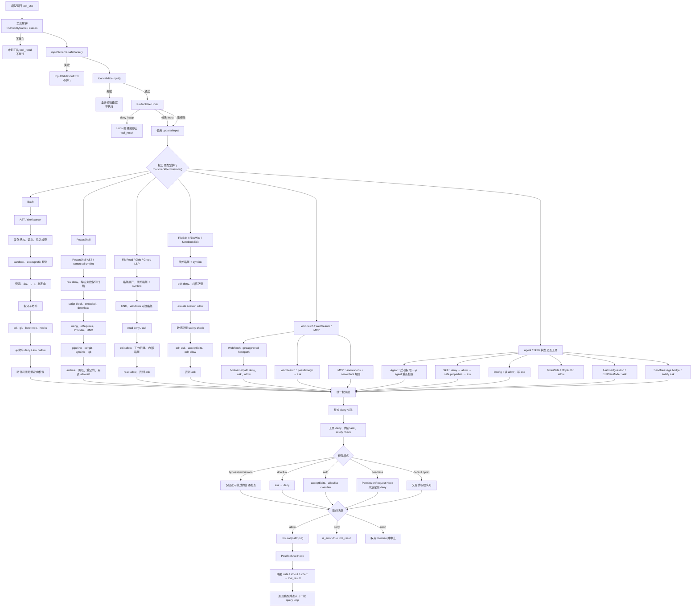

# Claude Code 工具系统分析

本文汇总前述四组问答，内容均依据本仓库源码整理。核心实现位于：

- `/home/runner/work/Claude-Code/Claude-Code/src/query.ts`
- `/home/runner/work/Claude-Code/Claude-Code/src/services/tools/toolExecution.ts`
- `/home/runner/work/Claude-Code/Claude-Code/src/services/tools/StreamingToolExecutor.ts`
- `/home/runner/work/Claude-Code/Claude-Code/src/Tool.ts`
- `/home/runner/work/Claude-Code/Claude-Code/src/utils/permissions/permissions.ts`

## 一、根据代码，分析 Claude Code 进行工具调用的完整生命周期

Claude Code 的工具调用是一个从模型输出 `tool_use` 开始，经过解析、校验、Hook、权限、执行和结果回传，再进入下一次模型推理的闭环。

### 1. 查询循环和模型输出

入口是 `query.ts` 中的查询逻辑。用户消息进入查询循环后，Claude Code 调用模型 API，并以流式方式接收响应。模型普通文本会被累积为 assistant 内容；模型输出 `tool_use` block 时，系统提取：

- 工具名称；
- `tool_use_id`；
- 模型提供的 input；
- assistant 消息上下文。

一次响应可能包含多个 `tool_use`。`StreamingToolExecutor` 负责把这些调用排队、分组并执行，同时保留结果顺序。

### 2. 工具解析和别名兼容

`runToolUse()` 通过 `findToolByName()` 查找工具，既匹配工具主名称，也匹配 `aliases`。找不到工具时不会调用任何实现，而是生成带原始 `tool_use_id` 的错误 `tool_result`，使模型知道该工具不可用。

工具接口由 `src/Tool.ts` 定义，主要契约包括：

- `inputSchema`：结构化输入 Schema；
- `validateInput()`：工具特定的业务和环境校验；
- `checkPermissions()`：工具特定的权限判断；
- `call()`：真正执行；
- `mapToolResultToToolResultBlockParam()`：把内部结果转换成模型可见的 `tool_result`；
- 并发安全、只读、路径和 classifier 展示信息。

### 3. Schema 校验

工具存在后，`runToolUse()` 调用：

```ts
tool.inputSchema.safeParse(input)
```

Schema 校验失败时生成 `InputValidationError`，不会继续执行 `validateInput()`、Hook、权限检查或 `tool.call()`。这一步负责类型和结构，例如：

- 必填字段是否存在；
- 字段是否为正确类型；
- 枚举值是否合法；
- 数组、对象、嵌套结构是否正确。

### 4. 工具级业务校验

Schema 成功后调用 `tool.validateInput()`。它处理不能仅靠类型表达的约束，即环境、资源、路径和业务规则。例如：

- Bash/PowerShell 阻塞式 `sleep` 命令；
- Read 的 PDF 页码格式和页数上限；
- 文件是否存在、是否为目录或文件；
- 文件是否过大、是否先读取过；
- 文件读取后是否发生变化；
- 二进制文件和危险设备文件；
- Jupyter notebook 是否应使用 NotebookEdit；
- settings 文件内容是否有效；
- 不允许向 team memory 文件写入 secret。

失败时返回工具错误，并设置 `is_error`，实际工具不会执行。

### 5. 输入副本、回填和观察输入

工具调用输入可能经历多份表示：

```text
模型原始 input
→ Schema 解析结果
→ backfillObservableInput()
→ PreToolUse Hook 修改
→ 权限返回的 updatedInput
→ callInput
```

`backfillObservableInput()` 在副本上执行，用于补充旧字段或派生字段；原始 API 输入不被修改，以保持 transcript 和 prompt cache 稳定。文件工具通常把 `~` 和相对路径扩展为绝对路径，防止 Hook allowlist 被路径写法绕过。

`processedInput` 用于 Hook、权限和观察；`callInput` 用于实际 `tool.call()`。文件路径回填不一定会传入 API 原始参数，从而避免改变 transcript。

### 6. PreToolUse Hook

业务校验成功后运行 PreToolUse Hook。Hook 可以：

- 修改工具输入，返回 `updatedInput`；
- 直接允许；
- 直接拒绝；
- 终止后续执行；
- 增加上下文、progress、反馈、图片或其他内容块。

Hook 的修改输入会进入后续权限检查。Hook 明确拒绝时，工具不执行；Hook 返回 stop 时，生成停止型结果。

### 7. 权限检查

随后进入 `canUseTool()` 和 `hasPermissionsToUseTool()`。权限逻辑由两部分组成：

1. `permissions.ts` 的通用规则、权限模式、auto classifier、headless 和 UI 流程；
2. 工具自己的 `checkPermissions()`，用于命令、路径、host、MCP server 等细粒度判断。

通用权限规则支持：

- 工具级规则；
- MCP server 级规则；
- 输入内容级规则；
- `allow`、`ask`、`deny`；
- session、project、user、local 等来源。

结果可以携带 `updatedInput`、反馈、内容块和 `decisionReason`。

### 8. 流式工具执行和并发

`StreamingToolExecutor` 负责：

- 工具排队；
- 根据 `isConcurrencySafe()` 分组；
- 并发执行安全工具；
- 对不安全工具串行执行；
- 转发 progress；
- 处理工具 abort；
- 维护结果顺序；
- 兄弟工具失败时生成 synthetic error 或取消其他调用。

例如多个只读工具可以并发，而可能修改同一状态的工具不能简单并发。

### 9. 实际工具执行

权限结果是 `allow` 后，调用：

```ts
tool.call(
  callInput,
  {
    ...toolUseContext,
    toolUseId,
    userModified,
  },
  canUseTool,
  assistantMessage,
  progressCallback,
)
```

上下文包含：

- AbortController；
- 当前工作目录；
- AppState；
- agent 信息；
- 文件读取状态；
- 权限上下文；
- MCP 信息；
- progress callback；
- 工具调用 ID。

工具可以在 `call()` 内部再次调用 `canUseTool()`，例如 Agent 的子工具或需要二次确认的操作。

### 10. 结果处理和 PostToolUse Hook

`call()` 返回内部输出后，执行 PostToolUse Hook。之后由工具的结果映射函数转换成模型协议的 `tool_result`：

- Bash 映射 stdout、stderr、图片和后台任务信息；
- Read 映射文件内容或图片；
- Edit/Write 映射编辑结果；
- MCP 映射远端返回内容；
- 错误结果设置 `is_error: true`。

结果保留原始 `tool_use_id`，并与 Hook 产生的附加消息一起加入下一轮上下文。

### 11. 回到模型

查询循环把所有工具结果作为下一轮消息发送给模型。模型可以：

- 根据工具结果继续调用其他工具；
- 修改参数重试；
- 解释错误；
- 结束本轮响应。

因此完整闭环是：

```text
query()
→ 模型流式响应
→ 提取 tool_use
→ 工具解析
→ Schema 校验
→ validateInput()
→ PreToolUse Hook
→ 权限检查
→ StreamingToolExecutor 调度
→ tool.call()
→ PostToolUse Hook
→ tool_result
→ 下一轮模型调用
```

### 12. 取消、错误和降级

任何阶段都可能发生 abort。取消可能来自用户、上层 query、兄弟工具失败、权限对话取消或远程 channel。Abort 类错误向上抛出并终止相关流程；普通工具失败通常被包装为 `tool_result.is_error`，交给模型处理。

权限 Hook、classifier、MCP 和解析器都有降级路径。无法证明安全时通常 `ask`，无法显示权限对话的 headless agent 通常 fail-closed，防止静默放行。

## 二、工具解析和输入校验具体内容是什么

工具解析和输入校验位于单个工具调用的前半段，核心实现是：

```text
/home/runner/work/Claude-Code/Claude-Code/src/services/tools/toolExecution.ts
/home/runner/work/Claude-Code/Claude-Code/src/Tool.ts
```

完整顺序是：

```text
模型原始 tool_use
→ 工具名称解析
→ Schema safeParse()
→ 输入回填
→ 工具 validateInput()
→ PreToolUse Hook
→ 权限检查
→ tool.call()
```

### 1. 工具名称解析

系统根据模型返回的工具名寻找已注册工具：

- 精确匹配工具主名称；
- 匹配工具 `aliases`；
- MCP 工具使用动态的 `mcp__server__tool` 名称；
- 找不到时生成未知工具错误。

未知工具不会尝试模糊执行，也不会进入权限和业务逻辑。

### 2. Schema 结构校验

每个工具提供 Zod 风格的 `inputSchema`。系统执行 `safeParse()`，失败后生成 `InputValidationError`。校验内容包括：

- 字段存在性；
- 字段类型；
- 数组元素；
- 对象嵌套结构；
- 联合类型；
- 枚举和字面量；
- 字符串、数字和布尔值限制；
- 工具特定的互斥或可选字段。

这一步只验证“输入长什么样”，不负责访问文件或判断命令是否安全。

### 3. 输入回填

`backfillObservableInput()` 用于在观察副本中补充派生字段，并且必须幂等。典型用途是：

- 将相对路径扩展为绝对路径；
- 兼容旧字段；
- 使 Hook、transcript 和权限看到稳定输入。

回填后的观察输入不一定完全等于传给 `call()` 的输入。

### 4. 工具级 validateInput()

`validateInput()` 只在 Schema 成功后调用。它负责环境和业务约束：

#### Bash / PowerShell

- 阻塞 sleep 检查；
- Windows sandbox policy；
- 后台执行要求；
- 其他与工具调用生命周期相关的前置约束。

#### FileRead

- PDF 页码是否为 `1-5`、`3` 等合法格式；
- 页数是否超过上限；
- 路径 deny rule；
- UNC 路径防御；
- 设备文件、二进制或不可读文件；
- 文件是否存在。

#### FileEdit

- team memory secret 检查；
- `old_string` 和 `new_string` 不能相同；
- 文件不能过大；
- 文件不存在时只有空 `old_string` 才可创建；
- 已存在文件不能被错误地当作新文件；
- `.ipynb` 应使用 NotebookEdit；
- 编辑前必须读过文件；
- 文件读取后不能被修改；
- old string 必须存在；
- 多处匹配时必须设置 `replace_all`；
- settings 文件编辑必须通过结构校验。

#### FileWrite

- 写入内容和路径检查；
- team memory secret；
- 设置文件和内部文件限制。

### 5. 校验失败的结果

Schema 失败或 `validateInput()` 失败时：

```text
不调用权限系统
不调用 tool.call()
生成错误 tool_result
通常设置 is_error=true
```

其中 `validateInput()` 也可以返回 `behavior: 'ask'`，例如 FileEdit 发现文件尚未读取；这表示工具输入或操作状态不满足要求，执行层会把该结果作为拒绝/询问型工具结果处理。

### 6. Hook 和权限对输入的继续修改

输入可能被 PreToolUse Hook 或权限结果再次替换：

```text
parsedInput
→ Hook updatedInput
→ permission updatedInput
→ callInput
```

权限返回的 `updatedInput` 可能来自用户确认时的修改，例如用户在权限界面编辑 Bash 命令或文件路径。最终 `tool.call()` 使用最新的 `callInput`。

### 7. 结构校验和业务校验的区别

```text
Schema 校验：
  这个值的类型和形状正确吗？

validateInput：
  这个值在当前环境、文件状态和业务规则下可执行吗？

checkPermissions：
  当前用户、权限规则和安全模式允许执行吗？
```

三者是不同层次，不能用 Schema 校验替代安全和权限校验。

## 三、权限检查的详细执行流程

权限入口是：

```text
/home/runner/work/Claude-Code/Claude-Code/src/hooks/useCanUseTool.tsx
/home/runner/work/Claude-Code/Claude-Code/src/utils/permissions/permissions.ts
/home/runner/work/Claude-Code/Claude-Code/src/hooks/toolPermission/PermissionContext.ts
```

主链路是：

```text
validateInput()
→ PreToolUse Hook
→ canUseTool()
→ hasPermissionsToUseTool()
→ hasPermissionsToUseToolInner()
→ 工具自身 checkPermissions()
→ allow / deny / ask
```

### 1. Abort 检查

权限上下文创建后先检查 AbortSignal。已取消时：

- 记录取消；
- resolve 取消结果；
- 必要时 abort 工具上下文；
- 不弹出新的权限对话框。

### 2. deny、ask、allow 规则

权限规则可以是：

```text
Bash
Bash(git *)
Read(/tmp/**)
Edit(src/**)
mcp__server
mcp__server__tool
```

规则来源可能是 session、local、project 或 user settings。

典型顺序：

```text
整个工具 deny
→ 整个工具 ask
→ 工具自身 checkPermissions()
→ 工具自身 deny
→ 内容级 ask
→ safety check
→ bypass / mode
→ 工具级 allow
→ passthrough 转 ask
```

deny 优先于 allow；显式 ask 优先于普通自动允许。

### 3. 工具自身的权限决定

工具的 `checkPermissions()` 返回：

```ts
{
  behavior: 'allow' | 'deny' | 'ask' | 'passthrough',
  message?,
  updatedInput?,
  decisionReason?,
  suggestions?
}
```

`passthrough` 不等于 allow，而表示工具没有做出最终决定，需要交给通用权限系统。

### 4. bypassPermissions

`bypassPermissions` 可以跳过一部分普通询问，但不是绝对绕过。以下情况仍可阻止或要求确认：

- 显式 deny；
- 工具自身 deny；
- 内容级 ask；
- safety check；
- 必须用户交互的工具；
- 跨机器 SendMessage；
- 某些敏感路径和命令。

### 5. dontAsk

`dontAsk` 会把最终 ask 转换为 deny，不显示权限对话框：

```text
ask → deny
```

### 6. auto 模式

auto 模式通常不立即弹窗，而是：

1. `acceptEdits` 快速判断；
2. 安全工具 allowlist；
3. auto classifier；
4. 记录连续拒绝和总拒绝次数；
5. classifier 不可用时按 feature flag fail-open 或 fail-closed。

classifier 可以返回 allow 或 deny。上下文过长时，交互环境回退普通确认；headless 环境可能直接 abort。

### 7. headless agent

不能显示权限对话框时先执行 `PermissionRequest` Hook：

```text
Hook allow → allow
Hook deny → deny
Hook 无决定 → 自动 deny
```

这样后台 agent 不会因无 UI 而静默放行危险操作。

### 8. 交互式确认

普通交互环境将请求放入队列，由终端 UI、bridge、channel、coordinator 或 swarm handler 处理。权限上下文使用 resolve-once / claim 机制，只有第一个响应生效。

用户可以：

- 本次允许；
- 永久或 session 允许；
- 拒绝并填写反馈；
- 修改输入；
- 取消并 abort。

### 9. 最终结果

```text
allow → tool.call()
deny  → tool_result.is_error=true
abort → 取消权限 Promise 并中止工具
```

普通 deny 通常不会让整个 Query 崩溃，而是将错误反馈给模型，让模型决定修改调用或停止。

## 四、每种工具自己的权限逻辑

### 1. Bash

入口：

```text
/home/runner/work/Claude-Code/Claude-Code/src/tools/BashTool/bashPermissions.ts
```

Bash 是权限逻辑最复杂的工具，目标是防止命令注入、路径逃逸、重定向写入、Git hook 和解析差异造成的绕过。

流程：

```text
tree-sitter AST
→ too-complex / semantic failure / parse-unavailable 处理
→ sandbox 自动放行
→ exact command 规则
→ Bash prompt classifier
→ 管道和操作符
→ 命令安全检查
→ 拆分子命令
→ cd / git 安全检查
→ 子命令 deny/ask/allow
→ 路径和重定向
→ 全部允许才 allow，否则 ask/deny
```

具体检查包括：

- tree-sitter 解析；
- 复杂命令和无法证明安全的结构；
- `eval`、shell builtin 和隐藏执行；
- 反引号、`$()`、变量和 heredoc；
- IFS、Unicode 空白、注释/引号错位；
- 管道、`&&`、`||`、`;`；
- `>`、`>>`、`2>` 和管道中的原始重定向；
- 多个 `cd`；
- `cd + git`；
- bare repository；
- Git 内部路径和 hooks；
- 每个子命令的 exact/prefix/wildcard 规则；
- 工作目录外路径；
- 子命令数量上限 50；
- 复合命令建议规则最多 5 条。

任何子命令 deny 都会使整体 deny；没有 deny 但有 ask 则整体 ask；全部 allow 且无注入风险才整体 allow。

### 2. PowerShell

入口：

```text
/home/runner/work/Claude-Code/Claude-Code/src/tools/PowerShellTool/powershellPermissions.ts
```

流程：

```text
PowerShell AST
→ 原始 exact/prefix deny/ask
→ alias/canonical 规范化
→ 解析失败保守扫描
→ powershellCommandIsSafe()
→ using / #Requires
→ Provider / UNC
→ pipeline 和嵌套命令
→ cd + git / symlink / .git
→ archive extraction
→ 路径和重定向
→ 只读 allowlist
→ deny > ask > allow > passthrough
```

PowerShell 规则大小写不敏感，并处理：

- `rm`、`del`、`ri` 到 `Remove-Item` 的 canonical 映射；
- module-qualified command；
- script block；
- encoded command；
- download cradle；
- `using module`、`using assembly`；
- `#Requires -Modules`；
- `env:`、`HKLM:`、`HKCU:`、`function:`、`variable:`、`registry:` 等 provider；
- UNC 路径；
- `Set-Location + git`；
- symlink 创建；
- `HEAD`、`refs`、`objects`、`hooks`、`.git`；
- `tar`、`unzip`、`7z` 等归档与 Git 的组合；
- PowerShell 重定向；
- 脚本文件和 executable 的 `nameType`；
- 参数中的环境变量泄漏。

解析失败时仍先执行 raw deny 和保守片段扫描；无法证明安全时 ask，不为无效语法建议保存规则。

### 3. FileRead

入口：

```text
/home/runner/work/Claude-Code/Claude-Code/src/tools/FileReadTool/FileReadTool.ts
```

工具自身调用 `checkReadPermissionForTool()`。权限流程是：

```text
expandPath
→ 原始路径和 symlink 真实路径
→ UNC
→ 可疑 Windows 路径
→ read deny
→ read ask
→ edit allow 推导 read allow
→ 工作目录 allow
→ 内部 harness 路径 allow
→ read allow
→ 默认 ask
```

`validateInput()` 另行检查 PDF 页码、页数上限、设备文件、二进制和文件读取约束。

### 4. Glob、Grep、LSP

这三类工具也是读取型工具，分别对搜索目录、grep 目标路径和 LSP 目标文件调用 `checkReadPermissionForTool()`。

- Glob 先验证搜索根目录存在且为目录；
- Grep 先验证搜索路径；
- LSP 先验证目标是普通文件；
- 最终都受 UNC、symlink、read deny/ask、工作目录和 allow rule 约束。

### 5. FileEdit

入口：

```text
/home/runner/work/Claude-Code/Claude-Code/src/tools/FileEditTool/FileEditTool.ts
```

权限部分调用 `checkWritePermissionForTool()`：

```text
edit deny
→ 内部可编辑路径
→ .claude session allow
→ 敏感路径 safety check
→ edit ask
→ acceptEdits + 工作目录
→ edit allow
→ 默认 ask
```

业务校验还包括：

- 先读后写；
- timestamp 和内容一致性；
- old string 存在且匹配数量正确；
- 防止编辑 `.ipynb`；
- 防止超大文件；
- 防止 team memory secret；
- settings 文件最终结构合法。

### 6. FileWrite

FileWrite 同样调用 `checkWritePermissionForTool()`，路径权限与 FileEdit 相同。其额外校验重点是：

- 新文件和已有文件；
- 写入内容；
- team memory secret；
- 内部路径；
- 配置和 settings 文件。

`acceptEdits` 只对允许工作目录内的写入自动放行。

### 7. NotebookEdit

NotebookEdit 的路径权限也调用 `checkWritePermissionForTool()`。具体 cell、`replace/insert/delete` 和 notebook 内容校验由自身 `validateInput()` 与 `call()` 完成。

### 8. WebFetch

入口：

```text
/home/runner/work/Claude-Code/Claude-Code/src/tools/WebFetchTool/WebFetchTool.ts
```

权限粒度是 hostname + pathname：

```text
URL 解析
→ preapproved host/path
→ hostname/path deny
→ hostname/path ask
→ hostname/path allow
→ 默认 ask
```

URL 解析失败时回到普通权限流程。ask 会给出精确 host/path 规则建议。

### 9. WebSearch

WebSearch 的 `checkPermissions()` 返回 `passthrough`，由通用层转换为 ask，并建议添加 WebSearch allow rule。

### 10. MCP

通用 MCPTool 以及动态 MCP client 工具默认返回 `passthrough`。动态包装还读取：

- `readOnlyHint`；
- `destructiveHint`；
- `openWorldHint`。

典型流程：

```text
远端 inputSchema
→ MCP annotations
→ passthrough
→ mcp__server__tool 规则
→ MCP server 级规则
→ auto classifier 或用户确认
→ client.callTool()
```

MCP 不会因为 server 已连接就自动允许；默认仍需规则、classifier 或用户确认。

### 11. Agent

Agent 在普通模式通常 allow；特定 auto 模式下返回 passthrough，由通用 classifier 决定。Agent 自身通常声明为只读，因为它主要负责委派。

真正的权限分两层：

```text
允许启动子 agent

+ 子 agent 内部调用 Bash/Edit/MCP 等工具时重新执行权限流程
```

### 12. Skill

Skill 的流程：

```text
去除前导 /
→ skill deny
→ canonical skill 特殊 allow
→ exact/prefix allow
→ 仅安全属性 allow
→ 默认 ask
```

支持 `skill-name` 和 `skill-name:*` 规则。prompt 类型且只有安全属性的 skill 自动 allow；未知属性默认要求权限。

### 13. Config

```text
没有 value（读取）→ allow
有 value（修改）→ ask
```

真正 setting 是否支持在 `call()` 中检查。

### 14. TodoWrite

直接 allow，不需要权限检查。它更新 session 或 agent 的 todo 状态，并可能在结束时附加 verification nudge。

### 15. AskUserQuestion

始终 ask，因为工具本身就是请求用户回答问题。即使模型有其他自动权限，也不能代替真实的用户交互。

### 16. ExitPlanMode

- teammate：allow，`call()` 内部向 leader 请求计划批准或本地退出；
- 普通用户：ask，显示 `Exit plan mode?`；
- `validateInput()` 会先确认当前确实处于 plan mode。

### 17. SendMessage

普通团队消息通常 allow。若目标是 bridge 跨机器消息，则返回不可被普通 bypass 或 classifier 静默绕过的 safety ask，因为它可能造成跨机器 prompt injection 或远程控制。

### 18. McpAuth

直接 allow。认证使用独立 OAuth 或 `/mcp` 流程，不通过普通工具权限对话阻塞。

### 19. SyntheticOutput 和 TestingPermissionTool

- SyntheticOutput：内部结果工具，直接 allow；
- TestingPermissionTool：固定 ask，用于测试权限界面和权限队列。

### 20. 其他内部工具

Task、Worktree、Workflow、MCP resource、Monitor、Brief、ToolSearch 等工具的细粒度行为主要由通用权限层、模式状态、feature gate、agent/coordinator 或 Hook 决定；没有 Bash、PowerShell 和文件工具那样的大型本地规则引擎。

## 五、将所有工具的权限逻辑放到同一个流程图中



## 六、统一归纳

所有工具可以归纳为四类：

```text
静态直接决策：
  TodoWrite、McpAuth、SyntheticOutput

路径型决策：
  FileRead、Glob、Grep、LSP、
  FileEdit、FileWrite、NotebookEdit

命令型决策：
  Bash、PowerShell

外部目标和交互型决策：
  WebFetch、WebSearch、MCP、
  AskUserQuestion、SendMessage、ExitPlanMode
```

最终统一原则是：

```text
abort
→ 显式 deny
→ 工具自身 deny
→ safety check
→ 显式 ask
→ 必须人工交互
→ bypass / acceptEdits / auto
→ allow 规则或安全白名单
→ passthrough 转 ask
→ headless 无 UI 自动 deny
→ tool.call()
→ PostToolUse Hook
→ tool_result
```

复合命令和多个检查结果遵循：

```text
deny > ask > allow > passthrough
```

因此 Claude Code 的权限系统不是单一的“是否允许工具”判断，而是将工具类型、输入内容、路径或远端目标、静态安全分析、权限规则、运行模式、Hook、classifier 和用户交互统一汇聚到一个最终决策中。
